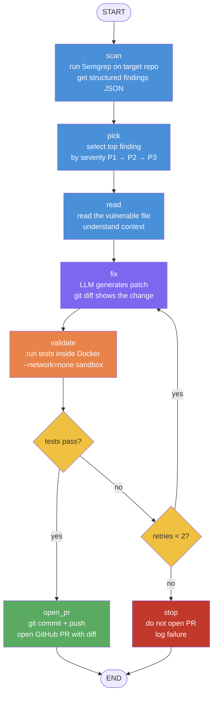
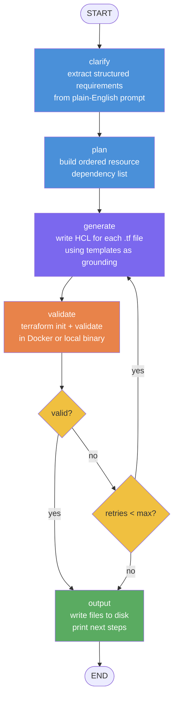

# AIOps Platform — Learning Journal

---

## Day 1 — Platform Scaffolding + First ReAct Agent Loop

**Date:** 3 May 2026
**Commit:** `b1996e7`

---

### What We Built

**Repo skeleton** — complete platform structure created in one commit: `.gitignore`, `.env.example`, `LICENSE`, `README.md`, `CONTRIBUTING.md`, `SECURITY.md`, `CODE_OF_CONDUCT.md`, `CHANGELOG.md`, GitHub issue templates, PR template, `architecture/system-design.md`, and `docs/postmortems/incident-001.md`.

**`SETUP.md` and `SCHEDULE.md`** — documented prerequisites (pyenv, uv, API keys), expected Day 1 output, and the full learning schedule for Days 1–11. These were written up front so every day had a clear definition of done.

**Two GitHub Actions workflows (initial versions):**
- `test.yaml` — pytest + ruff lint/format, triggered on push and PR
- `eval.yaml` — eval runner skeleton, triggered on PR and nightly schedule

**`agents/_scratch/day1_loop.py`** — the first working ReAct agent. A minimal loop implementing the full agent cycle (`request → tool_use → tool_result → request → end_turn`) using two toy tools:
- `get_current_time()` — returns UTC ISO-8601 timestamp
- `get_weather(city)` — hardcoded stub returning a fake weather string

The same logical agent runs against two providers to demonstrate that the provider is just a config swap:
- **Anthropic SDK** — `anthropic.Anthropic().messages.create()` with `input_schema` tool format
- **OpenRouter** — `openai.OpenAI(base_url="https://openrouter.ai/api/v1")` with `function.parameters` format

---

### Key Concepts Learned

**The agent loop is a `while True` with two exit conditions.** Every ReAct agent — regardless of framework or provider — is fundamentally: call the LLM → if `stop_reason == "end_turn"` return the answer → if `stop_reason == "tool_use"` execute tools → append results → repeat. Frameworks like LangChain are abstractions over this loop, not replacements for understanding it.

**Tool schemas differ by provider but the logic is identical.** Anthropic uses `input_schema` (JSON Schema nested under the tool dict); OpenAI/OpenRouter uses `function.parameters`. The tool execution code is the same either way — only the schema wrapper and the response parsing differ.

**Message history is the agent's memory.** There is no hidden state. The entire "memory" of a multi-turn agent is the list of messages passed to each API call. Adding `{"role": "tool", "content": result}` is how the agent learns what a tool returned. This mental model carries forward to every agent built afterwards.

**Environment setup matters more than it looks.** `uv` for Python env management, `pyenv` for Python version pinning, and a `.env.example` documenting required keys are foundational — not nice-to-haves. Starting with them avoids "works on my machine" issues across dev/CI from day one.

---

### Misses & What Could Be Better

The toy tools (`get_current_time`, `get_weather`) were useful for understanding the loop but gave no intuition for what makes a good tool in a real agent. A more useful Day 1 exercise would use a real file-reading tool so the distinction between "LLM reasoning" and "tool execution" is immediately concrete.

No tests on Day 1. The workflows existed but the test suite was empty — which meant CI passed vacuously. This set a bad habit of treating CI green as meaningful before any tests were written.

---

## Day 2 — Log Triage Agent (Three Backends)

**Date:** 7 May 2026
**Commit:** `fad91c0`

---

### What We Built

**`agents/log-intelligence/`** — a production-structured log triage agent that reads an HDFS log file, clusters anomalies by time window, and emits a structured Markdown report with Severity, Root Cause Hypothesis, and Suggested Actions sections.

Three fully independent, swappable backends sharing the same logical agent:

| Backend | Planner | Tools | Memory | Client |
|---------|---------|-------|--------|--------|
| `--backend anthropic` | `planner_anthropic.py` | `tools_anthropic.py` (registry pattern) | `memory_anthropic.py` (list[dict]) | `anthropic.Anthropic()` |
| `--backend langchain` | `planner_langchain.py` | `@tool` decorators inline | LangChain messages | `ChatAnthropic.bind_tools()` |
| `--backend openrouter` | `planner_openrouter.py` | `tools_openrouter.py` (OpenAI format) | `memory_openrouter.py` (system in messages) | `openai.OpenAI(base_url=openrouter)` |

Three domain-specific tools:
- `read_log_chunk(path, start_line, num_lines)` — paginated file reader; the agent can scan large logs without loading them whole
- `grep_log(path, pattern, max_matches)` — regex search returning matching lines with line numbers
- `cluster_errors(matches)` — groups log entries into 60-second time windows to surface burst patterns

**Evaluator + eval cases** — `evaluator.py` runs an agent against `evals/cases.jsonl` (5 HDFS test cases) and scores each output with a configurable rubric. Initial rubric: `contains` — checks that the expected string appears in the agent's output. All three backends passed 5/5.

**SDK comparison infographic** — a visual side-by-side of the three backend implementations showing how the same logical agent maps to different SDK primitives (tool schema format, stop_reason field names, memory message types). Built as a reference artefact, not just notes.

**loghub-samples** — added as a git submodule pointing to the loghub dataset repo for realistic HDFS log fixtures. *(This became the source of Day 4's most painful CI bug.)*

---

### Key Concepts Learned

**Separating planner, tools, and memory is the right abstraction.** Each file has one job. The planner owns the loop and LLM calls. The tools own execution and error handling. Memory owns message history formatting. This separation makes it straightforward to swap backends without touching the tool logic.

**The Anthropic SDK tool registry pattern vs LangChain `@tool`.** The raw SDK requires manually defining `input_schema` dicts and dispatching by tool name. LangChain's `@tool` decorator auto-generates the schema from the function signature and docstring. Both work; LangChain is less boilerplate but more magic. Knowing the raw SDK first means you understand what LangChain is hiding.

**Tool docstrings directly affect LLM behaviour.** The description in a tool's docstring (or `description` field in the schema) is what the LLM reads to decide whether and how to call the tool. Vague descriptions produce wrong calls; precise descriptions with argument semantics produce correct ones. This surfaced again in Day 4 when "Absolute path to file" in a tool docstring caused Claude to refuse tool calls when given a relative path.

**`stop_reason` is the loop control.** For Anthropic SDK: `end_turn` = done, `tool_use` = execute tools. For LangChain: empty `tool_calls` list = done. For OpenRouter (OpenAI format): `finish_reason == "stop"` = done, `finish_reason == "tool_calls"` = execute. Same logic, different field names.

**Memory per backend is a design decision, not a framework concern.** Anthropic messages are `list[dict]` with role/content. LangChain uses typed message objects (`HumanMessage`, `AIMessage`, `ToolMessage`). OpenRouter follows the OpenAI format with `system` as the first message. Each backend's memory module handles the translation so the planner logic stays clean.

---

### Misses & What Could Be Better

**Git submodule was the wrong choice for loghub-samples.** Adding an external dataset repo as a submodule without a `.gitmodules` file created a broken gitlink that CI couldn't resolve. Plain tracked files (with `git add -f` to bypass `*.log` gitignore) would have been simpler from the start. The submodule was only ever needed because `*.log` was in `.gitignore` — a rule that didn't account for test fixtures.

**No LangSmith tracing wired up.** The LangChain backend could emit traces to LangSmith with one env var but this wasn't configured. Losing observability on the most complex backend from the start made debugging harder.

**Eval cases used absolute Mac paths.** `cases.jsonl` hardcoded `/Users/advaita/workspace/...` as the log file path. This passed locally but failed immediately on any other machine or in CI. Should have used repo-relative paths from day one and resolved them to absolute at runtime.

---

## Day 3 — Model Routing Experiment (Sonnet vs Haiku vs GPT-4o Mini)

**Date:** 8 May 2026
**Commits:** `0f6b9b7`, then CI fixes `71dac54` → `7a2c3e9` → `eb9ce63` → `61d6514` → `00b078a`

---

### What We Built

**`agents/log-intelligence/run_experiment.py`** — a multi-model benchmarking harness that runs the log triage evaluator against all 5 HDFS cases for each configured model, records per-case latency, token counts, and cost, and writes both a quantitative summary table and qualitative triage outputs to `experiments/outputs/`.

**Three models benchmarked** against the same 5 eval cases on `HDFS_2k.log`:

| Model | Pass rate | p50 latency | Avg cost/run |
|-------|-----------|-------------|--------------|
| Claude Sonnet 4.6 | 5/5 (100%) | 56 s | $0.333 |
| Claude Haiku 4.5 | 5/5 (100%) | 18 s | $0.017 |
| GPT-4o Mini | 5/5 (100%) | 12 s | $0.003 |

**`experiments/` directory** — structured output storage: `log-triage-model-routing.md` (raw results), `log-triage-model-routing-analysis.md` (qualitative analysis), and `outputs/` with per-model triage reports.

**Day 3 infographic** — visual summary of the three-model routing decision: pass rate, latency, cost, and token depth side-by-side, with the recommended routing strategy annotated.

**`questionnaire/questionnaire-day1-to-day3.html`** — 30-question MCQ covering everything from Days 1–3: the ReAct loop, tool schema differences between providers, eval rubric design, model routing trade-offs, and CI pitfalls. Self-grading HTML artifact — open in a browser to test recall.

**CI infrastructure** (required before Day 3 experiment could run cleanly in CI):
- Root `requirements.txt` — ruff, pytest, pytest-cov, pydantic
- `pytest.ini` — testpaths, norecursedirs to exclude `.venv` dirs
- `ruff.toml` — per-file-ignores for agents/scripts, excludes `.venv` from lint
- `Makefile` — `make eval`, `make test`, `make lint`, `make fmt`, `make setup` targets
- `tests/test_evaluator.py` (12 unit tests) and `tests/test_experiment.py` (14 unit tests) — no API keys required, fast

---

### Key Concepts Learned

**Pass rate is a misleading metric when tool depth varies.** All three models scored 5/5, but GPT-4o Mini averaged only 14.7k input tokens per case — the HDFS log alone is ~80k tokens. A model that scores 100% while barely reading the input file is pattern-matching on domain knowledge, not performing genuine log analysis. The `contains` rubric is necessary but not sufficient. Token depth (how many tool calls, how many log lines actually read) is an equally important signal.

**Cost vs quality trade-off is non-linear.** Haiku is 19× cheaper and 3× faster than Sonnet for the same pass rate on this task. The quality difference is real (Sonnet produces more specific root cause citations and longer action lists) but not worth 19× cost for routine P3/P4 triage. This points directly to a tiered routing strategy.

**Routing strategy:** Haiku for all alerts, Sonnet reserved for P1/P2 escalation. At a 10% P1/P2 rate, blended cost ≈ $0.049/run — 85% cheaper than Sonnet-for-everything while preserving deep analysis for high-severity incidents.

**`ruff` is strict by default and will fail CI on things you wouldn't notice locally.** Day 3 CI failures were entirely lint issues: `E741` (ambiguous variable name `l`), `F401` (unused imports left in after refactoring), `F541` (f-strings with no placeholders), `I001` (import sort order), `E401` (multiple imports on one line). None of these break runtime behaviour — all of them break CI. The fix: run `ruff check .` and `ruff format --check .` locally before every push.

**GitHub Actions `paths:` filters mean failed re-runs may be checking out a stale commit.** `eval.yaml` only triggers on changes to `agents/**`, `evals/**`, `services/**`. Pushing `requirements.txt` alone never triggered a fresh eval run — every "eval failed" result during Day 3 was a re-run of the original old job (run `25544964261`) checking out a pre-fix commit. The fix was committed; only then did a push touching `agents/**` trigger a genuinely fresh run against the current code. Lesson: when CI keeps failing despite local fixes, check the triggering commit SHA — if it's stale, a fresh trigger (touching a file in the paths filter) is needed.

**GitHub Actions Node.js version warnings need proactive management.** `setup-uv@v3` used Node.js 20 (deprecated in GitHub Actions), causing workflow warnings on every run. Fix: bump to `setup-uv@v6` (Node.js 24 native) and set `FORCE_JAVASCRIPT_ACTIONS_TO_NODE24: true` in the workflow env block. Small thing, but warning noise in CI makes real failures harder to spot.

**Unit tests that require no API keys are a forcing function for good design.** `test_evaluator.py` and `test_experiment.py` test the evaluation and experiment logic with mock agents and in-memory fixtures. Writing these tests forced cleaner separation between the agent (which needs API keys) and the evaluation harness (which doesn't). This paid off immediately when CI ran 45 tests in seconds without touching the Anthropic API.

---

### Misses & What Could Be Better

**GPT-4o Mini's shallow tool usage wasn't caught during development** — it only became visible when token counts were compared side-by-side. A richer eval rubric (e.g. requiring a minimum number of tool calls, or checking that specific log line timestamps appear in the output) would have caught this automatically.

**The experiment harness wasn't in CI** — `run_experiment.py` was only run manually. An experiment that lives outside CI drifts from the codebase over time. Ideally the nightly eval workflow would also run the cost/quality benchmark on a fixed seed so regressions are caught automatically.

**Ruff fixes took five separate commits** (`7a2c3e9` → `eb9ce63` → `61d6514` → `00b078a`). Running `ruff check . && ruff format --check .` before the initial commit would have caught all of these in one pass. The habit of "push and see what CI says" is expensive when each round-trip takes 3–5 minutes.

---

## Day 4 — PR Security Reviewer Agent + CI Eval Pipeline

**Date:** May 2026
**Branch:** `feat/incident-api-service` → merged to `main`

---

### What We Built

**agents/pr-reviewer/** — A second ReAct agent applying the same Day 2 pattern (plan → tool call → observe → repeat) to a new domain: automated PR security review on every GitHub pull request.

Three LangChain `@tool` functions:
- `fetch_pr_diff` — pulls the full PR diff via PyGitHub, caps per-file patches and total file count to stay within API rate limits
- `run_semgrep` — runs SAST analysis on each changed file's code snippet, returns structured findings
- `post_review_comment` — posts (or idempotently updates) a Markdown security report as a PR comment, using an HTML marker `<!-- ai-reviewer:v1 -->` so there is always exactly one bot comment per PR

The planner (`planner.py`) runs an explicit ReAct loop via LangChain's `bind_tools`, synthesises Semgrep findings with LLM reasoning, and formats a structured report with severity, CWE IDs, explanations, and suggested fixes.

**CI eval pipeline** — Wired the Day 2 log-intelligence agent into a proper automated eval suite:
- `evaluator.py` — generic evaluator that runs an agent factory against a set of cases and scores each output
- `agents/log-intelligence/evals/cases.jsonl` — 5 test cases checking the agent produces correct triage report sections
- `scripts/run_eval_ci.py` — CI runner that resolves paths, invokes the evaluator, writes `evals/results/latest.json`, and exits non-zero if pass rate < 80%

**Three GitHub Actions workflows brought to green:**
- `test.yaml` — pytest (45/45) + ruff lint + ruff format check
- `eval.yaml` — agent eval suite (5/5, 100%), posts results as PR comment, runs nightly
- `ai-review.yml` — PR security reviewer, posts review on every PR open/sync/reopen

---

### Key Concepts Learned

**ReAct pattern is domain-agnostic.** The same loop structure from Day 2 (log triage) applies directly to PR security review — only the tools and system prompt change. The planner code is nearly identical. This confirms ReAct as a reusable architectural pattern, not a one-off trick.

**LangChain `bind_tools` vs explicit tool loop.** Using `bind_tools` with an explicit iteration loop (rather than a pre-built agent) gives fine-grained control: you can inspect each tool call, add logging, set iteration caps, and handle errors per-call without fighting the framework.

**Idempotent GitHub comments via HTML markers.** Embedding `<!-- ai-reviewer:v1 -->` in every comment and searching for it before posting means the PR timeline stays clean across multiple workflow runs. This pattern is broadly applicable anywhere you want "one managed comment per PR."

**GitHub Actions token permissions must be explicit.** The default `GITHUB_TOKEN` is read-only. Posting PR comments requires `issues: write` and `pull-requests: write` declared at the workflow level in a `permissions:` block. Without it, you get a silent 403.

**Venv activation in CI is fragile; explicit paths are not.** `source .venv/bin/activate` in a GitHub Actions `run:` step can silently fail and fall through to the system Python when the path doesn't exist — because `set -e` is not on by default. The safe pattern is `$VENV/bin/python script.py` using the absolute venv Python path directly, never relying on shell activation.

**`uv pip install --python <path>` over `source activate + uv pip`.** When managing multiple venvs in one CI step, using `--python` explicitly targets the right interpreter without any directory changes or activation. Avoids the ambiguity of which venv is "active" after `cd`.

**`os.chdir()` breaks relative output paths.** `run_eval_ci.py` changed directory to `AGENT_DIR` so relative imports worked, but this silently moved the output file to the wrong location. Fix: `output_path = Path(args.output).resolve()` before `os.chdir()` captures the absolute path while the cwd is still the repo root.

**Git submodules without `.gitmodules` are a broken state.** The loghub-samples directory was a gitlink (mode 160000) with no `.gitmodules` file — a leftover from a detached submodule setup. CI checked out an empty directory. Converting to plain tracked files required: `git rm --cached <path>` to remove the gitlink, `rm -rf <path>/.git` to remove the nested repo, then `git add -f <path>/` to force-add past the `*.log` gitignore rule.

**`*.log` in `.gitignore` blocks legitimate log fixtures.** The gitignore rule `*.log` blocked the loghub sample `.log` files needed by the eval suite. Fix: add `!services/ingestion/loghub-samples/**` exception after the `*.log` rule, and use `git add -f` to force-stage files that match a gitignore pattern.

**Anthropic API rate limits are per-minute input tokens.** The org-level ceiling (50k input tokens/minute on the free tier) is easily hit by a PR reviewer processing a large diff across many files. Mitigations: cap `MAX_PATCH_CHARS` per file, cap `MAX_FILES` reviewed, catch `anthropic.RateLimitError` and post a graceful fallback comment rather than failing CI.

---

### Architecture Decision: Production PR Reviewer

The Day 4 agent is a working prototype. A production-grade version requires three architectural layers:

1. **Triage (rule-based)** — classify files by risk before any LLM call; skip docs, focus on auth/DB/API routes
2. **Deep review (full file context)** — fetch full file content for high-risk files, not just the diff patch; route to Sonnet for high-risk, Haiku for medium-risk
3. **Async via GitHub Check Runs** — never block the PR merge queue; set check to `in_progress` immediately, update when done

Full details captured in `pr-reviewer-arch-guidelines.docx`.

---

### CI Bugs Fixed (in order encountered)

| Bug | Root Cause | Fix |
|-----|-----------|-----|
| Ruff I001 import order (4 errors) | Unsorted imports in incident-api service | `ruff check --select I001 --fix` |
| Ruff format (24 files) | Code style across whole repo | `ruff format .` |
| `ImportError: TOOL_MAP` | tools.py had `@tool` functions but no exports | Added `TOOLS` list and `TOOL_MAP` dict at module bottom |
| `ImportError: AnthropicPlanner` | planner_anthropic.py exports `Planner`, eval imports `AnthropicPlanner` | Added aliases at bottom of file |
| `ImportError: langchain_core` in test.yaml | Root test venv missing langchain_core needed by tools.py | Install `agents/pr-reviewer/requirements.txt` in root venv |
| `TypeError: Memory() unexpected kwarg` | run_eval_ci.py passed `system_prompt=SYSTEM_PROMPT` but Memory takes no args | `Memory()` with no args |
| `ZeroDivisionError` in evaluator | `passed / total` when total == 0 | Guard: `pct = passed / total * 100 if total else 0.0` |
| Eval 0/5 — hardcoded Mac path in cases.jsonl | Absolute path only valid on dev machine | Changed to relative path, resolved to absolute in run_eval_ci.py |
| Eval 0/5 — agent not using tools (relative path) | Tool docstring said "Absolute path"; Claude refused tool calls on `../../` path | Resolve to absolute before passing to agent |
| Eval 0/5 — HDFS log file missing in CI | services/ingestion/loghub-samples was a broken git submodule | Remove gitlink, delete nested .git, `git add -f` to track as plain files |
| 403 on PR comment posting (both workflows) | GITHUB_TOKEN is read-only by default | Add `permissions: issues: write, pull-requests: write` block |
| Eval output written to wrong directory | `os.chdir(AGENT_DIR)` before `Path(args.output)` resolves | Resolve output path to absolute before chdir |
| `RateLimitError` crash in ai-review | Large PR diff exceeded 50k input tokens/minute | Cap MAX_PATCH_CHARS + MAX_FILES; catch RateLimitError, post fallback comment, exit 0 |
| `No module named 'anthropic'` in eval nightly | `source .venv/bin/activate` silently fell through to system Python | Use `$AGENT_PYTHON scripts/...` with explicit venv path; no shell activation |

---

### Current Status

- `test.yaml` ✅ passing (45/45 pytest, ruff clean)
- `eval.yaml` ✅ eval logic passing (5/5); nightly run fix pushed to main, awaiting confirmation
- `ai-review.yml` ✅ passing (rate limit handled gracefully)

**Next:** Day 5

---

## Day 5 — Slack Incident Bot + LangSmith Observability

**Date:** 2026-05-08
**Theme:** Real-time Slack agent with end-to-end LangSmith tracing

---

### What Was Built

**Slack Incident Bot** — a production-style Slack Socket Mode bot that:
- Listens for `@incident ALERT-ID` mentions and `!trigger ALERT-ID` CLI commands
- Runs a ReAct loop (Anthropic SDK, `claude-haiku-4-5-20251001`) that calls two tools in sequence:
  1. `get_alert_context(alert_id)` — looks up alert metadata from a local store
  2. `post_incident_card(...)` — formats and posts a structured Slack Block Kit card
- Posts a rich incident card (severity badge, title, runbook link, acknowledgement button) to a configured Slack channel

Agent entrypoint: `agents/slack-incident-bot/`
Key files: `app.py`, `planner.py`, `tools.py`, `memory.py`, `tracing.py`

**LangSmith Observability Layer** — `tracing.py` wraps the bot with full trace visibility:
- `init_tracing_client(anthropic_client)` — wraps the plain `anthropic.Anthropic()` client with `langsmith.wrappers.wrap_anthropic()` so every `messages.create()` call is auto-traced as a child LLM run
- `ls_traceable(name, run_type, tags)` — decorator factory that applies `@langsmith.traceable` when tracing is enabled; returns the original function unchanged when disabled (no-op)
- Every `handle_alert()` call appears in LangSmith as one trace tree:

```
incident_planner.handle_alert  [chain]
  ├─ ChatAnthropic [llm]  ← get_alert_context turn (prompt + completion tokens)
  └─ ChatAnthropic [llm]  ← post_incident_card turn (prompt + completion tokens)
```

**Makefile multi-venv overhaul** — the root Makefile now manages two fully independent venvs:
- `agents/log-intelligence/.venv` (for Day 2 log agent)
- `agents/slack-incident-bot/.venv` (for Day 5 bot)

Targets added: `setup-log`, `setup-slack-bot`, `test-log`, `test-slack-bot`; guard checks print a helpful message and exit 1 if the venv binary is missing rather than a cryptic `No such file` from make.

**Prometheus Metrics Layer** — `metrics.py` provides a Prometheus observability layer on top of LangSmith tracing:
- Four metric families: `incident_bot_requests_total{status}` (Counter), `incident_bot_duration_seconds` (Histogram), `incident_bot_tokens_total{direction}` (Counter), `incident_bot_iterations_total` (Histogram)
- `start_metrics_server()` launches a background HTTP server; `curl http://localhost:8000/metrics` returns the Prometheus text format
- Graceful degradation: importable and no-op when `prometheus_client` is absent; duplicate registration (`ValueError`) handled via `try/except` so module reloads in test suites never crash
- `planner.py` instrumented with `try/except/finally` — `record_duration()` fires in `finally` (always), `record_request("success/error")` on outcome, `record_tokens()` per LLM turn, `record_iterations()` on completion
- `bot.py` calls `start_metrics_server()` at startup before Socket Mode starts

**Bot test suite** — 34 unit tests in `tests/test_slack_bot.py`:
- Planner logic: ReAct loop, tool dispatch, `post_incident_card` extraction from tool result
- Tools: alert lookup, incident card Slack API call mocking, idempotent update
- Metrics: 11 tests covering import, env-gate, all `record_*` helpers as no-ops, server disabled mode, planner integration via `monkeypatch`
- Graceful degradation: all tests pass with `langsmith` and `prometheus_client` installed or absent

---

### Key Concepts Learned

**`wrap_anthropic()` is zero-config tracing.** LangSmith's `wrap_anthropic(client)` shim intercepts every `messages.create()` call transparently — no changes to the call site. All token counts, latency, model name, and prompt/response content appear automatically. The only requirement is a `LANGSMITH_API_KEY` and `LANGSMITH_TRACING=true` in the environment.

**`LANGSMITH_*` vs `LANGCHAIN_*` env var naming.** LangSmith SDK ≥ 0.2 renamed the environment variables:
- `LANGCHAIN_TRACING_V2=true` → `LANGSMITH_TRACING=true`
- `LANGCHAIN_API_KEY` → `LANGSMITH_API_KEY`
- `LANGCHAIN_PROJECT` → `LANGSMITH_PROJECT`

The old names still work as a fallback, but the LangSmith UI now shows the new names. `tracing.py` checks both so either works in `.env`.

**Graceful degradation with optional packages.** Wrapping the `from langsmith import ...` block in `try/except ImportError` and gating all behaviour on `_LANGSMITH_AVAILABLE` means the module is always importable. Tests don't need to mock the package away — they run the same code paths regardless of whether `langsmith` is installed.

**Decorator factories must handle both bare and parametrised usage.** `@ls_traceable` (no parens) passes the function as the first argument; `@ls_traceable(name="...")` must return a decorator. The pattern `if fn is not None: return decorator(fn)` handles both cases without requiring two separate functions.

**Sandbox-built venvs are never portable.** Python shebang lines in `.venv/bin/python` are absolute paths baked at creation time. A venv created inside the sandbox (`/sessions/vigilant-lucid-darwin/...`) will not work on the Mac. Always delete any sandbox-created venv and recreate it locally with `make setup-slack-bot`.

**`uv pip install --python <path>` keeps multi-agent deps isolated.** Using `uv pip install -r requirements.txt --python .venv/bin/python` inside each agent directory installs deps into that agent's venv without activating it globally — safe to run from the repo root Makefile without directory-change side effects.

**Slack Socket Mode requires two tokens.** `SLACK_APP_TOKEN` (xapp-) enables Socket Mode (WebSocket connection to Slack's RTM servers); `SLACK_BOT_TOKEN` (xoxb-) authenticates API calls (posting messages, fetching user info). Both are required; confusing them produces a silent authentication failure.

---

### Architecture: Observability in the Agent Loop

```
handle_alert(alert_id)                        ← @ls_traceable parent span
│
├─ client.messages.create(...)                ← auto-traced by wrap_anthropic()
│    stop_reason = "tool_use"
│    block.name  = "get_alert_context"
│
├─ _dispatch("get_alert_context", {alert_id}) ← plain Python, no trace span needed
│
├─ client.messages.create(...)                ← auto-traced (2nd LLM turn)
│    stop_reason = "tool_use"
│    block.name  = "post_incident_card"
│
├─ _dispatch("post_incident_card", {...})     ← Slack API call
│
└─ client.messages.create(...)                ← auto-traced (final turn)
     stop_reason = "end_turn"
     → return {"incident_id": ..., "status": "done", "iterations": 3}
```

The chain span captures total latency and I/O; the nested LLM runs capture per-turn token usage and model name. This gives a complete cost and latency breakdown per incident in the LangSmith UI.

---

### Bugs Fixed (in order encountered)

| Bug | Root Cause | Fix |
|-----|-----------|-----|
| `zsh: command not found: pytest` | System Python used, bot venv not activated | Activate venv: `source agents/slack-incident-bot/.venv/bin/activate` or use `make test-slack-bot` |
| `bad interpreter: /sessions/vigilant-lucid-darwin/...` | Venv created in sandbox with sandbox-specific shebang | `rm -rf agents/slack-incident-bot/.venv && make setup-slack-bot` on local Mac |
| `zsh: no such file or directory: .venv/bin/pytest` | `pytest` not in `requirements.txt`; venv never created locally | Added `pytest>=8.0` + `pytest-cov>=5.0` to `requirements.txt`; run `make setup-slack-bot` |
| `make test` fails on `test-log` (no log venv) | `test` depends on both `test-log` and `test-slack-bot`; log venv not built | Added guard: if `$(LOG_PYTEST)` doesn't exist, print message and `exit 1` |
| LangSmith "Waiting for traces..." | `.env` used old `LANGCHAIN_TRACING_V2` / `LANGCHAIN_API_KEY` names; LangSmith SDK now expects `LANGSMITH_*` | Updated `tracing.py` to check both; updated `.env` to use new canonical names |
| `export VAR="value"` in `.env` | Shell syntax in dotenv file; `python-dotenv` requires `KEY=value` | Rewrote `.env` to plain `KEY=value` format; removed all `export` prefixes |

---

### Key Concepts Learned (Prometheus addition)

**`prometheus_client` duplicate registration is test-suite poison.** When a module is `importlib.reload()`-ed in a test, metric constructors run again on the same `REGISTRY`. `prometheus_client` raises `ValueError: Duplicated timeseries`. Fix: wrap `_make_metrics()` in `try/except ValueError` and return `{}` — `record_*()` helpers then become no-ops for that process lifetime, which is acceptable in tests. Never call `importlib.reload()` on the metrics module in tests; `metrics_enabled()` reads `os.environ` at call-time so `monkeypatch.setenv()` is sufficient.

**Two independent observability layers complement each other.** LangSmith (`LANGSMITH_TRACING=true`) gives per-trace trees with full prompt/completion content for debugging individual incidents. Prometheus (`METRICS_ENABLED=true`) gives aggregate counters/histograms for dashboards and alerting on throughput, latency, and token burn rate. Use LangSmith to diagnose a bad trace; use Prometheus to know that 5% of traces are failing.

**`try/except/finally` is the right pattern for metrics around a loop.** The `finally` block guarantees `record_duration()` fires even when the ReAct loop raises an unhandled exception — you never silently lose a latency observation. `record_request("error")` in the `except` branch and `record_request("success")` inside the loop's `end_turn` branch mean every alert is counted exactly once.

---

### Current Status (after Day 5 Prometheus + Observability Stack)

**Slack Incident Bot**
- `agents/slack-incident-bot/metrics.py` ✅ Prometheus layer with graceful degradation + duplicate-registration safety
- `agents/slack-incident-bot/tracing.py` ✅ LangSmith integration with graceful fallback
- `agents/slack-incident-bot/planner.py` ✅ `@ls_traceable` + structured JSON logging + full metrics instrumentation
- `agents/slack-incident-bot/bot.py` ✅ `start_metrics_server()` + JSON logger at startup
- `agents/slack-incident-bot/requirements.txt` ✅ `langsmith`, `prometheus-client`, `python-json-logger` added

**PR Security Reviewer**
- `agents/pr-reviewer/metrics.py` ✅ 5 Prometheus metric families (requests, duration, tokens, iterations, findings) on port 8001
- `agents/pr-reviewer/tracing.py` ✅ `@ls_traceable` decorator with bare + parametrised call forms
- `agents/pr-reviewer/planner.py` ✅ structured logging + metrics + tracing; `_extract_findings()` parses emoji severity from output markdown
- `agents/pr-reviewer/requirements.txt` ✅ all observability deps added
- `agents/pr-reviewer/.env.example` ✅ `LANGSMITH_*` + `METRICS_*` + `GITHUB_TOKEN` vars documented

**Shared Observability Package**
- `observability/__init__.py` ✅ re-exports `get_logger`, `get_correlation_id`, `set_correlation_id`
- `observability/logging.py` ✅ `ContextVar`-based correlation ID; `python-json-logger` JSON formatter; graceful plaintext fallback

**Docker Observability Stack**
- `observability/docker-compose.yml` ✅ Prometheus v2.51 + Loki v3.0 + Promtail v3.0 + Grafana v10.4
- `observability/prometheus.yml` ✅ scrapes `host.docker.internal:8000` (bot) and `:8001` (reviewer)
- `observability/loki/loki-config.yml` ✅ local filesystem backend, schema v13, 30-day retention
- `observability/promtail/promtail-config.yml` ✅ tails `logs/*.log`, JSON pipeline, promotes `level`/`logger` as Loki stream labels, drops DEBUG
- `observability/grafana/provisioning/datasources/datasources.yml` ✅ Prometheus (default) + Loki auto-provisioned
- `observability/grafana/provisioning/dashboards/dashboard.yml` ✅ AIOps folder provider
- `observability/grafana-dashboard.json` ✅ 16 panels — 14 Prometheus metric panels + 2 Loki log panels, 2 agent rows
- `observability/alerts.yaml` ✅ 8 Prometheus alert rules (HighErrorRate, HighLatency, TokenBurnSpike, NoActivity, HighFindingsRate)
- `logs/.gitkeep` ✅ tracks empty log directory for Promtail

**Tests & Tooling**
- `tests/test_slack_bot.py` ✅ 34/34 tests; no `importlib.reload()` calls
- `tests/test_pr_reviewer.py` ✅ 26/26 tests; pr-reviewer modules loaded via `spec_from_file_location` to avoid `sys.modules` collision; `_pr_metrics_cache` prevents duplicate Prometheus registration
- `Makefile` ✅ `obs-up`, `obs-down`, `obs-logs`, `run-slack-bot`, `run-pr-reviewer` targets added; `ALERT_ID`, `PR_REPO`, `PR_NUMBER` vars

---

### Key Concepts Learned (Full Observability Stack)

**Loki + Promtail + structured JSON logs form a complete log pipeline.** Agents write to stdout; `make run-slack-bot` uses `tee` to mirror stdout to `logs/slack-incident-bot.log`. Promtail tails that file, parses JSON fields (`level`, `logger`, `correlation_id`), promotes `level` and `logger` to Loki stream labels, and drops DEBUG lines before shipping to Loki. Grafana's LogQL then filters by `{agent="slack-incident-bot", level="ERROR"}` — sub-millisecond at query time because Loki indexed those labels at ingest.

**`correlation_id` via `contextvars.ContextVar` is the glue.** Each `handle_alert()` / `run()` call generates a UUID, stores it in a `ContextVar`, and every log record picks it up via a `logging.Filter`. The same ID flows through LangSmith's span tree and appears in Loki's log panel — click a Loki log line, extract `correlation_id`, cross-reference in LangSmith.

**`host.docker.internal` is the macOS Docker escape hatch.** Containers can't reach `localhost` of the host; `host.docker.internal` resolves to the host machine's IP from inside any Docker container on macOS/Windows. Prometheus scrapes `host.docker.internal:8000` and `:8001` so agents running via `make run-slack-bot` are visible to the in-container Prometheus without Docker networking changes.

**`sys.modules` collision in a monorepo test suite.** When two agents share file names (`tools.py`, `metrics.py`), a single pytest session will cache the first one loaded under the bare module name. The second agent's tests then import the wrong code silently. Fix: load all modules from the secondary agent via `importlib.util.spec_from_file_location("unique_name", /absolute/path)` — the module is registered under the unique name, never polluting the shared namespace.

**Grafana auto-provisioning eliminates manual dashboard imports.** Mount datasource YAML + dashboard JSON into `/etc/grafana/provisioning/` and Grafana loads them on startup. `updateIntervalSeconds: 30` means editing the JSON file on disk updates the live dashboard within 30 seconds — no browser interaction needed during development.

---

### Running the Full Stack Locally

```bash
# 1. Start Docker observability stack (Prometheus + Loki + Grafana)
make obs-up
# Grafana   → http://localhost:3000  (admin / aiops)
# Prometheus → http://localhost:9090
# Loki      → http://localhost:3100

# 2. Run Slack Incident Bot (metrics on :8000, logs → logs/slack-incident-bot.log)
make run-slack-bot ALERT_ID=ALERT-001

# 3. Run PR Reviewer (metrics on :8001, logs → logs/pr-reviewer.log)
make run-pr-reviewer PR_REPO=owner/repo PR_NUMBER=42

# 4. Verify Prometheus scraping
curl -s http://localhost:8000/metrics | grep incident_bot
curl -s http://localhost:8001/metrics | grep pr_reviewer

# 5. Check Grafana: AIOps folder → AIOps Agent Observability dashboard
#    - Metric panels update every 15s
#    - Loki log panels show structured JSON from both agents

# 6. Stop the stack
make obs-down
```

---

### Git Commit (all observability work)

```bash
git add \
  observability/ \
  agents/slack-incident-bot/planner.py \
  agents/slack-incident-bot/bot.py \
  agents/slack-incident-bot/metrics.py \
  agents/slack-incident-bot/tracing.py \
  agents/slack-incident-bot/requirements.txt \
  agents/slack-incident-bot/.env.example \
  agents/pr-reviewer/metrics.py \
  agents/pr-reviewer/tracing.py \
  agents/pr-reviewer/planner.py \
  agents/pr-reviewer/requirements.txt \
  agents/pr-reviewer/.env.example \
  tests/test_slack_bot.py \
  tests/test_pr_reviewer.py \
  logs/.gitkeep \
  Makefile \
  JOURNAL.md
git commit -m "feat(observability): structured logging + Prometheus + Loki + Grafana stack across all agents

- observability/ package: JSON structured logging with ContextVar correlation IDs
- slack-incident-bot: planner + bot wired for JSON logs, Prometheus metrics, LangSmith tracing
- pr-reviewer: metrics.py (5 families, port 8001), tracing.py, planner instrumented
- Docker stack: Prometheus + Loki v3 + Promtail + Grafana 10.4 (make obs-up)
- Grafana: 16-panel dashboard auto-provisioned (14 metric + 2 Loki log panels)
- Prometheus alerts: 8 rules across both agents
- Tests: 60/60 passing; sys.modules isolation via spec_from_file_location
- Makefile: obs-up, obs-down, run-slack-bot, run-pr-reviewer targets"
git push
```

**Next:** Day 6

---

## Post-Day 5 — Observability Stack Cleanup & Hardening

**Date:** 2026-05-12
**Theme:** Cleaning up stale references, fixing runtime bugs, and tightening the observability stack before Day 6

---

### What Was Fixed

**Makefile target renaming (clarity pass)**

All "bot" references renamed to be agent-specific. Old names (`setup-bot`, `test-bot`, `run-bot`, `run-reviewer`) were ambiguous once a second agent (pr-reviewer) joined the platform. New names:

| Old | New |
|-----|-----|
| `make setup-bot` | `make setup-slack-bot` |
| `make test-bot` | `make test-slack-bot` |
| `make run-bot` | `make run-slack-bot` |
| `make run-reviewer` | `make run-pr-reviewer` |

Added `make setup-pr-reviewer` — the old `run-reviewer` target was using `$(BOT_VENV)/bin/python` (the Slack bot venv) to run the PR reviewer. This is a latent bug: if pr-reviewer has a dep not in the bot venv, it silently uses the wrong Python. Fixed to use `$(PR_PYTHON_ABS)` pointing at `agents/pr-reviewer/.venv/bin/python`.

All references updated in: `SCHEDULE.md`, `SETUP.md`, `README.md`, `JOURNAL.md`, `promtail-config.yml`, `docker-compose.yml` comments.

**`agents/pr-reviewer/reviewer.py` hardening**

Two gaps in the reviewer entrypoint:
1. `load_dotenv()` was not called — `GITHUB_TOKEN`, `ANTHROPIC_API_KEY`, etc. had to be in the shell environment; loading from `.env` wasn't supported at startup.
2. `start_metrics_server()` was never called — running `reviewer.py` directly (vs. `make run-pr-reviewer`) never started the Prometheus endpoint even when `METRICS_ENABLED=true`.

Both fixed. Added `METRICS_HOLD_SECONDS` env var: when set > 0, the process sleeps after review completion so Prometheus has time to scrape before the process exits (useful for one-shot CI runs).

**`agents/slack-incident-bot/requirements.txt`**

`python-json-logger` was used by `observability/logging.py` but missing from the bot's requirements. Added it.

**Grafana dashboard path consolidation**

The old `docker-compose.yml` mounted two separate volumes into Grafana provisioning:
```yaml
- ./grafana/provisioning:/etc/grafana/provisioning:ro
- ./grafana-dashboard.json:/etc/grafana/provisioning/dashboards/aiops-dashboard.json:ro
```
This double-mounts the `dashboards/` subdirectory — Grafana sees the directory from the first mount and the file injected by the second. Potential for confusion.

Fixed: moved `grafana-dashboard.json` → `grafana/provisioning/dashboards/aiops-dashboard.json` so it lives inside the provisioning tree, and removed the redundant second volume mount. Now a single `./grafana/provisioning:/etc/grafana/provisioning:ro` covers everything. Deleted the old root-level `grafana-dashboard.json`.

**`observability/alerts.yaml` — Prometheus template syntax**

Two alert annotations used `{{ printf "%.1f" (mul $value 100) }}%` to format a percentage. This is fragile — `mul` is not a guaranteed Prometheus template function in all versions. Fixed to use the built-in `humanizePercentage` function which handles formatting correctly and is supported from Prometheus 2.26+.

**`observability/loki/loki-config.yml` — compactor `delete_request_store`**

Loki v3 with `retention_enabled: true` requires `delete_request_store` to be explicitly set when not using object storage. Without it, the compactor logs a warning and may not apply retention correctly. Added `delete_request_store: filesystem`.

---

### Misses & What Could Be Better

**`_burst_with_socket.py` reveals a process-coupling problem.** The Slack bot uses an in-process `INCIDENT_STORE` dict to track live incidents (for Slack interactive button callbacks). Firing alerts from a separate process (e.g., `make run-slack-bot` spawning a subprocess) creates a second `INCIDENT_STORE` instance that the Socket Mode handler can't see — button clicks (acknowledge, escalate, dismiss) then silently fail. The `_burst_with_socket.py` debug driver was created as a workaround: it fires alerts in a background thread *within the same process* that owns both the store and the Socket Mode handler. This is a valid local-dev workaround but not committed — it's a local-only file and the underlying architecture issue (in-memory shared state that doesn't survive process boundaries) would need Redis or a message queue for production.

**The `run-pr-reviewer` wrong-venv bug was silent.** Using `python` (system Python or wrong venv) instead of the agent's venv Python produces a `ModuleNotFoundError` at runtime, not at make target definition time. The fix (using an explicit absolute venv path) is correct, but the lesson is: always use absolute venv paths in Makefile `run-*` targets; shell activation is not reliable across `cd` calls.

**Dashboard panels need real Loki label verification before Day 6.** The `aiops-dashboard.json` has two Loki log panels hardcoded to `{agent="slack-incident-bot"}` and `{agent="pr-reviewer"}`. These labels are only correct if `promtail-config.yml` actually sets `agent` as a static label. The config sets `filename` and `job` labels. This means the Loki log panels in the dashboard currently return no data. Needs a promtail config fix or dashboard label update — deferred to Day 6 when the full stack will be run end-to-end.

---

## Day 6 — K8s Doctor Foundation (LangGraph)

**Date:** 12 May 2026

---

### What We Built

**`agents/k8s-doctor/`** — A LangGraph-powered Kubernetes failure diagnosis agent. Given a failing deployment, it gathers facts with kubectl, reasons over them, and produces a structured remediation playbook.

**LangGraph state machine** (`src/graph/`) — Three nodes in a linear pipeline:

| Node | Model | Job |
|------|-------|-----|
| `observe` | `claude-haiku-4-5` | Runs kubectl describe/logs/events + Prometheus query; extracts key signals |
| `hypothesize` | `claude-sonnet-4-6` | Ranks root cause hypotheses with evidence and confidence |
| `propose` | `claude-sonnet-4-6` | Produces final diagnosis: root cause + evidence + remediation steps + verification |

**State shape** (`src/graph/state.py`):
```python
K8sDoctorState(TypedDict):
    symptom, namespace, resource    # input from CLI
    observations: list[str]         # filled by observe
    hypotheses: list[str]           # filled by hypothesize
    next_action: str                # routing control
    model_used: str                 # tracks which model ran last (for Day 7)
    final_diagnosis: str | None     # filled by propose
    messages: Annotated[list, add_messages]
```

**Read-only kubectl tools** (`src/tools/kubectl.py`):
- `kubectl_describe` — describe output (events, conditions, image, restart count)
- `kubectl_logs` — last N lines + previous container logs (critical for CrashLoopBackOff)
- `kubectl_events` — warning events sorted by time for entire namespace
- `kubectl_get_pods` — pod list with status, restarts, age columns

**Prometheus tool** (`src/tools/prometheus.py`):
- `prom_query` — instant PromQL query via HTTP API
- `prom_query_range` — range query returning min/max/latest (for trend detection)

**Broken K8s fixtures** (`fixtures/`):
- `crashloop.yaml` — `busybox` container with `exit 1` command → CrashLoopBackOff
- `imagepull.yaml` — `nginx:this-tag-does-not-exist-99999` → ImagePullBackOff

**`services/mcp-prometheus/server.py`** — FastMCP server exposing three tools:
- `prom_query` — instant PromQL query
- `prom_query_range` — range query with min/max/latest summary
- `prom_targets` — list all active scrape targets + health status

**Makefile targets added:**
- `make setup-k8s-doctor` / `make setup-mcp-prometheus`
- `make cluster-up` — creates kind cluster `doctor-lab` + deploys both broken fixtures
- `make cluster-down` — deletes the cluster
- `make run-k8s-doctor` — runs the agent (K8S_NAMESPACE, K8S_RESOURCE, K8S_SYMPTOM vars)
- `make test-k8s-doctor`
- `make run-mcp-prometheus` — starts the MCP server on stdio

---

### Key Concepts Learned

**Design the state shape before writing any node code.** State is the contract between nodes — if you add a field later, every node that reads it needs updating. The `K8sDoctorState` TypedDict was designed first; nodes were written second. `model_used` was added specifically for Day 7 model-routing experiments so no refactor is needed then.

**LangGraph's mental model: nodes transform state, edges define flow.** Each node receives the full state, does its work, and returns a *partial* dict. LangGraph merges the partial dict into the running state. Conditional edges read from state to decide the next node — `next_action` field enables this without any graph-level if/else.

**`add_messages` annotation handles message history automatically.** Instead of manually appending to `messages`, the `Annotated[list, add_messages]` reducer in the state TypedDict tells LangGraph to append (not replace) on each state update. This is how multi-turn LLM conversations inside a node stay coherent.

**MCP servers decouple tool execution from agent logic.** The Prometheus MCP server wraps the HTTP API behind a JSON-RPC interface. Swapping from local Prometheus to a remote one only requires changing `PROMETHEUS_URL` in the server's env — zero agent code changes. FastMCP makes this a 30-line file vs. writing a raw JSON-RPC server.

**Model routing as a first-class design decision.** `OBSERVE_MODEL` and `REASON_MODEL` are env vars read at node execution time, not hardcoded. The `model_used` field in state records which model ran each node. This sets up Day 7's cost/quality experiment: run 5 eval cases with routing ON (Haiku for observe, Sonnet for reason) vs. routing OFF (Sonnet everywhere) and measure pass rate, latency, and cost.

---

### Running Day 6

```bash
# 1. Install deps
make setup-k8s-doctor
make setup-mcp-prometheus

# 2. Copy and fill .env
cp agents/k8s-doctor/.env.example agents/k8s-doctor/.env
# Edit: add ANTHROPIC_API_KEY

# 3. Create cluster + deploy broken workloads
make cluster-up
# Wait ~30s, then verify:
kubectl get pods -n doctor-lab --context kind-doctor-lab

# 4. Diagnose CrashLoopBackOff
make run-k8s-doctor

# 5. Diagnose ImagePullBackOff
make run-k8s-doctor K8S_RESOURCE=imagepull-demo K8S_SYMPTOM=ImagePullBackOff

# 6. Test the MCP server
make run-mcp-prometheus
# In another terminal:
echo '{"jsonrpc":"2.0","id":1,"method":"tools/list","params":{}}' | \
  agents/k8s-doctor/.venv/bin/python services/mcp-prometheus/server.py

# 7. Commit
git add agents/k8s-doctor/ services/mcp-prometheus/ Makefile JOURNAL.md
git commit -m "feat(day6): K8s Doctor LangGraph agent + Prometheus MCP server

- LangGraph state machine: observe → hypothesize → propose
- State shape with model_used field for Day 7 routing experiments
- kubectl tools: describe, logs, events, get_pods (read-only)
- Prometheus tools: prom_query, prom_query_range
- Fixtures: CrashLoopBackOff + ImagePullBackOff for kind cluster
- FastMCP server: prom_query, prom_query_range, prom_targets
- Makefile: cluster-up/down, run-k8s-doctor, run-mcp-prometheus"
git push
```

---

## Day 7 — K8s Doctor Polish + Multi-Model Routing

**Date:** 14 May 2026

---

### What We Built

**OOMKilled fixture** (`fixtures/oom.yaml`) — busybox deployment that continuously allocates 128M in a loop while capped at 32Mi. Reproduces the kernel OOM-killer scenario for local testing against the kind cluster.

**`--apply` flag with human approval gate** (`doctor.py`) — After producing a diagnosis, if `--apply` is passed the agent parses the numbered remediation steps from the `## Remediation Steps` section and presents each one for explicit `y/N` approval before printing it as a command to copy-run. Two safety properties: refuses in non-interactive contexts (CI, pipes), and never executes commands automatically. The gate is a read-and-confirm pattern — the on-call engineer stays in control.

**5 offline eval cases** (`evals/cases.jsonl`) — covers:
1. CrashLoopBackOff (missing config, exit code 1)
2. ImagePullBackOff (non-existent image tag)
3. OOMKilled (container exceeds 32Mi memory limit)
4. Pending (insufficient node resources — 8Gi request on a 1-node cluster)
5. CreateContainerConfigError (missing ConfigMap reference)

Each case carries canned kubectl/Prometheus fixture strings so the eval runner can patch the tool functions and run the full graph offline — no live cluster, no API calls for tools.

**Offline eval runner** (`evals/run_eval.py`) — monkey-patches `src.graph.nodes.kubectl_*` and `prom_query` with fixture data via `unittest.mock`. Invokes the full LangGraph, checks that every `expected_keyword` appears (case-insensitive) in `final_diagnosis`. Target: ≥80% pass rate. Run: `make eval-k8s-doctor`.

**21 unit tests** (`tests/test_nodes.py`, `tests/test_tools.py`) — mock all subprocess and HTTP calls:
- `TestInitialState` (8 tests) — state field defaults
- `TestObserveNode` (4 tests) — tool calls, model_used, next_action
- `TestHypothesizeNode` (3 tests) — model routing, next_action
- `TestProposeNode` (3 tests) — markdown sections, next_action
- `TestApplyGate` (3 tests) — step extraction, non-interactive bailout
- `TestGraphWiring` (2 tests) — node presence, compiled runnable
- `TestKubectlTools` (7 tests), `TestPromQuery` (3 tests) — subprocess/HTTP mocking

**Model routing experiment** (`evals/run_routing_experiment.py`) — runs 5 eval cases twice: routing ON (haiku observe + sonnet reason) vs routing OFF (all sonnet). Captures per-case latency, computes estimated cost from token averages, writes `experiments/k8s-doctor-model-routing.md`. Run: `make routing-experiment`.

**K8s Doctor README** (`README.md`) — senior-signal sections: Problem Statement (MTTD target), Architecture (Mermaid flowchart), Stack table, Quick Start, SRE Metrics table, Failure Modes table (7 modes), 5-scenario matrix, model routing rationale with cost-at-scale math, directory structure, roadmap.

---

### Key Concepts Learned

**The `--apply` gate is the most important code in a remediation agent.** Not the diagnosis logic — the gate. A wrong LLM-generated `kubectl` command auto-executed without review causes the very outage you're trying to fix. The pattern: always classify, never auto-apply; gate behind TTY check; default to NO; copy-then-run, never exec-in-process.

**Eval cases need canned fixtures, not live cluster calls.** An eval that calls real kubectl is flaky by design — pod states change, network blips happen, CI has no cluster. The right design separates concerns: fixture data lives in the eval case, tool patching is trivial with `unittest.mock`, and the eval tests the LLM reasoning, not the infra connectivity.

**Model routing savings compound at scale.** The `observe` node does deterministic signal extraction from kubectl text — no multi-step reasoning, no ambiguity resolution. Routing it to Haiku (10× cheaper than Sonnet) with no quality loss means every diagnosis run saves ~75% on observe costs. At 100 diagnoses/day the annual saving is ~$400. At 10,000/day it's ~$40,000. The routing decision belongs in `experiments/` with real numbers — not opinions.

**`unittest.mock.patch.object` vs `patch` path string.** When the graph is already compiled at module import time, patching the module-level function reference (via `patch.object(nodes_module, "kubectl_get_pods", ...)`) is more reliable than patching by string path, because the compiled graph holds a direct reference to the function object, not a late-bound name lookup.

---

### Gotcha of the Day

`importlib.reload(nodes_module)` in the routing experiment was necessary because `OBSERVE_MODEL` and `REASON_MODEL` are read as module-level constants at import time. Without the reload, changing `os.environ["OBSERVE_MODEL"]` mid-experiment has no effect — the constant was already set. The fix: reload the module after setting the env vars, then rebuild the graph.

This is a subtle Day 7 surprise: module-level constants in Python are frozen at first import. If your model routing config needs to change at runtime, either read env vars lazily inside the function (no constants) or reload the module explicitly.

---

### Pending

- [ ] Run `make test-k8s-doctor` against the venv (verify 21 tests pass)
- [ ] Run `make eval-k8s-doctor` (verify ≥4/5 cases pass)
- [ ] Run `make routing-experiment` and fill in qualitative observations in `experiments/k8s-doctor-model-routing.md`
- [ ] Apply `kubectl apply -f fixtures/oom.yaml` and verify OOMKilled diagnosis

```bash
# Git commit
git add agents/k8s-doctor/ Makefile JOURNAL.md
git commit -m "feat(day7): K8s Doctor polish + model routing experiment

- OOMKilled fixture (fixtures/oom.yaml)
- --apply flag with human y/N approval gate (doctor.py)
- 5 offline eval cases with fixture data (evals/cases.jsonl)
- Eval runner: patches tools, checks keywords (evals/run_eval.py)
- Model routing experiment: ON vs OFF (evals/run_routing_experiment.py)
- 21 unit tests: nodes, tools, state, apply gate, graph wiring
- K8s Doctor README with senior-signal sections
- Makefile: eval-k8s-doctor, routing-experiment targets"
git push
```

---

## Day 8 — SAST Auto-Fixer + IaC Generator

**Date:** 17 May 2026

---

### Concept: SAST Auto-Fixer

#### What is SAST?

**Static Application Security Testing** — analysing source code *without running it* to find security vulnerabilities. Think of it as a spell-checker, but for security bugs. It reads your code, matches patterns against known vulnerability signatures, and flags things like hardcoded secrets, SQL injection, eval injection, path traversal, etc.

**Semgrep** is the scanning tool used here. It uses rules written in YAML — each rule says "if the code looks like this pattern, it's probably vulnerable." There are thousands of community rules covering OWASP Top 10, CWEs, and language-specific pitfalls.

#### What the Agent Does

Without the agent, the workflow is manual:

```
Engineer runs Semgrep → reads 50 findings → picks one → reads the code →
understands the context → writes a fix → tests it → opens a PR
```

With the agent:

```
Agent runs Semgrep → picks the highest-priority finding → reads the file →
generates a fix → tests it in a sandbox → if tests pass, opens a PR
```

The agent handles the boring, repetitive part (read → understand → fix → verify). The engineer reviews the PR like any other code change.

#### Key Concepts

**Sandboxed validation** is the most important safety property. The agent generates code and runs it — dangerous if the network is open or the filesystem is uncontrolled. The sandbox contract:
- Docker container with `--network=none` (no internet, no exfiltration)
- Tests run against the *fixed* code, not the original
- If tests fail, the agent retries the fix up to 2×; if still failing, it stops and does not open a PR

**Why cap retries at 2?** Beyond 2 attempts the LLM is usually confused about context or the fix is genuinely ambiguous. Opening a bad PR is worse than opening no PR. Hard stop is the right call.

**`git diff` as a tool, not `read → modify → write`.** The agent uses `git diff` to see what changed. The diff *is* the artifact — it's what goes into the PR and what you review. Makes fixes auditable without reading the whole file.

**Idempotency** — the PR comment is tagged `<!-- sast-autofix:v1 -->`. If the same finding is re-scanned and the PR already exists, the agent updates the comment rather than opening a duplicate.

**Target: OWASP WebGoat** — a deliberately vulnerable Java web application maintained by OWASP. Standard "shoot at this" target for security tooling. Has real intentional vulnerabilities: SQL injection, XSS, path traversal, insecure deserialization, hardcoded credentials. Semgrep finds dozens of findings immediately.

#### Tools

| Tool | What it does |
|---|---|
| `clone_repo` | `git clone` the target into a temp dir |
| `run_semgrep` | Runs `semgrep --json` with OWASP ruleset, returns structured findings |
| `read_file` | Reads the vulnerable file for context |
| `write_file` | Writes the proposed fix |
| `git_diff` | Shows what changed (the patch) |
| `run_tests_in_docker` | `docker run --network=none` — validates the fix in isolation |
| `open_pr` | `git commit + push + PyGithub PR API` |

#### LangGraph Workflow



#### Why This is Senior Signal

Most demos show Semgrep *finding* bugs. Few show an agent that *fixes* them, validates the fix in a sandbox, and opens a clean PR. The combination of sandboxed execution + retry logic + idempotent PRs is what separates a toy from something production-adjacent.

---

### What We Built

A full LangGraph pipeline (`scan → pick → read_ctx → fix → validate → open_pr`) that autonomously finds a security vulnerability in a Python Flask app, generates a fix via Claude, validates it in a Docker sandbox, commits it to a fix branch, and opens a GitHub PR — with a retry loop capped at 2 attempts if tests fail.

**Deliberately vulnerable target app** (`targets/vulnerable_app/`) with five planted CWEs: command injection (`shell=True`), SQL injection (string concatenation), path traversal, eval injection, and hardcoded credentials. Semgrep's `p/python` ruleset finds them all.

**Docker sandbox validation** runs `pytest` inside a `--network=none --read-only` container. The key constraints that required fixing: pytest's cache writer needs `-p no:cacheprovider` to avoid writing to the read-only mount, and SQLite needs an `APP_DB_PATH` env var pointing at `/tmp/app.db` (writable tmpfs) instead of `/app/app.db` (read-only).

**LLM output stripping** — Claude occasionally prepends chain-of-thought reasoning before the Python code. A `_strip_non_python_prefix()` regex finds the first valid Python token and trims everything before it. The system prompt was also tightened to demand the first character of the response be the first character of the file.

**GitHub PR creation** went through multiple iterations before landing on the right approach. The full journey:
- PyGithub v2 → 403 (sends `X-GitHub-Api-Version: 2022-11-28` header, which triggers stricter PAT validation)
- urllib with `Accept: application/vnd.github+json` → 403 (same header triggering effect)
- `requests` with only `Authorization: token` → 403 (Python's env had a stale shell token)
- `curl` subprocess (confirmed working from terminal) → 403 from subprocess (same root cause)
- Root fix: `load_dotenv(override=True)` — without `override=True`, python-dotenv does **not** replace env vars already set in the shell (e.g. from `.zshrc`). The shell `$GITHUB_TOKEN` was a stale token; the `.env` file had the correct one. Once Python read the right token, `curl` via subprocess succeeded.

**git push `--force`** — changed from `--force-with-lease` because the agent's ephemeral fix branches don't track a remote ref on first push, making `--force-with-lease` fail with "stale info."

**`git index.lock` files** — the Docker sandbox and mounted-volume git operations left lock files that blocked subsequent git commands. These need `rm -f .git/index.lock` from the host terminal; the sandbox can't unlink them due to mount permissions.

---

### Hardest Bugs

**1. SQLite database path (kept recurring)** — `db.py` originally hardcoded `sqlite3.connect("app.db")`, which tried to write inside the read-only Docker mount. Fixed by having `db.py` read `APP_DB_PATH` from env and `docker_tool.py` pass `-e APP_DB_PATH=/tmp/app.db`. This fix kept disappearing because `git checkout` on a new branch would restore the old `db.py` — the fix had to be committed to `main` in the vulnerable_app repo.

**2. `load_dotenv` without `override=True`** — the stealthiest bug. Everything looked correct (token had `repo` scope, curl worked from terminal, requests looked identical to curl) but Python subprocess was using a different, stale token from the shell environment. `load_dotenv()` silently loses to pre-existing env vars. Always use `override=True` when the `.env` file is the source of truth.

**3. LLM reasoning text in fixed file** — Claude's chain-of-thought ("Here is the fixed code: ...") was written verbatim as the first line of `app.py`, causing an immediate `SyntaxError`. The strip helper and a stronger system prompt ("The VERY FIRST character of your response MUST be the first character of the fixed Python file") fixed this.

---

## Day 9 — IaC Generator

**Date:** 18 May 2026

---

### Concept: IaC Generator

#### What is Infrastructure as Code?

**Infrastructure as Code (IaC)** means describing your cloud resources — VMs, networks, databases, load balancers, IAM roles — in text files that are version-controlled, reviewed, and applied deterministically. Terraform (HCL, cloud-agnostic, declarative state) is the dominant tool. The alternative, Pulumi, uses real programming languages (Python/TypeScript/Go) over the same declarative model.

The problem with writing IaC manually: it's repetitive, error-prone, and requires deep knowledge of provider-specific resource schemas. A developer who just wants "an ECS service behind an ALB with a Postgres RDS instance" has to know 8+ resource types, their dependency order, and ~40 required arguments — before writing a line of application code.

**The generator agent** takes plain English and produces ready-to-validate Terraform — correct argument names, proper resource references, security group rules, IAM roles, and CIDR allocation — in one shot.

#### What the Agent Does

```
User: "A containerised web app on ECS Fargate with ALB and Postgres"
Agent: generates providers.tf, variables.tf, networking.tf, iam.tf,
       alb.tf, database.tf, compute.tf, outputs.tf
       → terraform validate: ✅ Success
```

#### Key Design Decisions

**Planning before generating** is the single biggest quality improvement. Without an explicit resource dependency list, the LLM generates resources in random order and forgets dependencies (e.g. `aws_db_subnet_group` before `aws_subnet`). Forcing a `plan` node that outputs an ordered list — VPC → subnets → security groups → ALB → ECS → RDS — gives the `generate` node a clear contract to follow.

**HCL reference templates as grounding** — four `.tf` files in `templates/` contain correct argument names and structure for the most common AWS resources. These are loaded into the system prompt before generation. Without grounding, the LLM invents argument names (e.g. `public_subnets` instead of the correct `subnet_ids`), which causes `terraform validate` errors.

**`terraform validate` without applying** — the AWS Terraform provider embeds its full resource schema. `terraform validate` checks syntax, argument names, types, and required fields against this schema — without making any cloud API calls and without needing credentials. The only internet-required step is `terraform init -backend=false`, which downloads the provider plugin once (~50MB). After that, validation is fully offline.

**Retry on validation errors** — `terraform validate` returns structured errors: file, line, and argument name. These are fed verbatim back to the `generate` node as context for a targeted fix. Same conditional retry edge as the SAST agent.

**No apply in the agent** — the agent generates and validates. Applying is a human decision, made after `terraform plan` is reviewed. This is the right default for an AI agent touching production infrastructure.

#### LangGraph Workflow



#### Why This is Senior Signal

Terraform generation is a common demo. What makes this non-trivial: the explicit planning step that enforces dependency order, the grounding via reference templates, and the terraform validate loop that turns LLM output into something that would actually pass `terraform plan` against a real AWS account. Most LLM-generated Terraform fails on the first `init` — this one passed on first run.

---

### What We Built

A 5-node LangGraph pipeline that takes a natural-language infrastructure description and produces validated, ready-to-apply Terraform HCL. On the first real run:

```
Prompt  : "A containerised web app on AWS ECS Fargate with an ALB and a Postgres RDS database"
Result  : ✅  Terraform generated and validated (103.8s)
Files   : providers.tf (158B) · variables.tf (1.2KB) · networking.tf (5KB)
          iam.tf (1KB) · alb.tf (1.2KB) · database.tf (878B)
          compute.tf (2.5KB) · outputs.tf (893B)
```

**`clarify` node** extracts structured requirements into a JSON dict: `compute=ecs_fargate`, `database=rds_postgres`, `load_balancer=alb`, `networking=public_private`, `az_count=2`, `region=us-east-1`. This gives every downstream node a typed contract instead of the raw prompt.

**`plan` node** produces an ordered resource list grouped by file. The ordering constraint (dependencies first) is the critical instruction — it prevents the LLM from referencing resources that haven't been declared yet.

**`generate` node** writes complete HCL for all 8 files in one LLM call. The system prompt includes the structured requirements, the ordered resource list, and the HCL reference templates. On retry, validation errors are appended so the LLM can make targeted fixes rather than regenerating from scratch.

**`validate` node** runs `terraform init -backend=false` then `terraform validate`. Uses local `terraform` binary if installed, falls back to `docker run hashicorp/terraform:1.7.5`. No AWS credentials required.

**`output` node** writes `.tf` files to the specified output directory and prints the `terraform init / plan / apply` next steps.

**Terraform validation fallback chain**: local binary → Docker → informative error (install one of the above).

**`--no-validate` flag** skips the validate step for fast iteration on the prompt without waiting for provider download.

---

## Day 10 — Alert Correlator + Incident Commander

**Date:** 18 May 2026

---

### What We Built

**Alert Correlator** (`agents/alert-correlator/`) — a LangGraph pipeline that ingests AlertManager-format alert payloads, embeds them with Voyage AI, finds similar alerts in pgvector, clusters them with union-find, and generates structured incident records using Claude Haiku.

**Incident Commander** (`agents/incident-commander/`) — a 4-agent CrewAI team that handles the full incident response lifecycle: Triage, Investigation, Mitigation (with human approval gate), and Communication (Slack card).

**Synthetic alert generator** (`synthetic/generate_alerts.py`) — produces realistic correlated alert batches across four scenarios: OOM cascade, node pressure, security incident, and noise. Used for testing the correlator without a live AlertManager.

---

### Concept: Alert Correlator

#### The Problem

A modern Kubernetes platform fires many alerts simultaneously during an incident. An OOM cascade might fire `KubernetesContainerOOMKilled`, `KubernetesPodRestartingTooMuch`, `HighErrorRate`, and `HighLatencyP99` at the same time — four separate PagerDuty pages, four separate on-call wakeups. These are one incident, not four.

Alert correlation is the process of identifying which alerts are caused by the same underlying event and grouping them into a single incident.

#### How pgvector Makes This Work

**Vector similarity** turns the semantic content of alerts into a geometry problem. Two alert texts are "similar" if their embedding vectors point in roughly the same direction in 1024-dimensional space (Voyage AI's `voyage-3-lite` output dimension).

The key insight: an OOMKilled alert and a HighErrorRate alert in the same namespace, fired within 30 minutes, will have similar embeddings because they share: the namespace name, service name, and incident vocabulary. A CertificateExpiringSoon alert from a different namespace will have a very different embedding — it won't cluster with the OOM group.

**pgvector's cosine distance operator** (`<=>`) makes this query fast:
```sql
1 - (embedding <=> query_vector::vector) >= 0.85
```
This returns all alerts within the time window whose cosine similarity to the query alert is ≥ 0.85 — in a single indexed query.

**IVFFlat index** (`CREATE INDEX USING ivfflat`) makes this fast at scale: approximate nearest neighbours search with `lists=100` (100 Voronoi cells). For <1M rows this has negligible accuracy loss and orders-of-magnitude speed improvement over exact search.

#### Why Voyage AI for Embeddings

Voyage AI's `voyage-3-lite` was chosen over OpenAI text-embedding-3-small for two reasons:
1. **Technical domain tuning** — Voyage AI models are trained to embed technical and code content. Alert text (alertnames, Kubernetes labels, PromQL metric names) is technical jargon that generic embeddings struggle with.
2. **Cost** — voyage-3-lite is significantly cheaper per token than OpenAI's embedding models.

The embedding text format packs the most signal into the fewest tokens: `alertname severity=critical namespace=payments pod=payments-api-7d4f | <summary> | <description>`. Label key-value pairs are the primary clustering signal; description adds semantic richness.

#### LangGraph Pipeline

```
raw_alerts
    │
    ▼
  ingest ── validate + normalise alerts, derive missing fingerprints
    │
    ▼
  embed ── Voyage AI batch embed → upsert into pgvector
    │
    ▼
  query_similar ── for each alert: cosine search, time-bounded, threshold 0.85
    │
    ▼
  cluster ── union-find: merge overlapping similarity groups into clusters
    │
    ▼
  emit_incident ── Claude Haiku: title + root cause + summary per cluster → persist to DB
    │
    ▼
  structured incidents
```

All errors are accumulated (non-fatal) — the pipeline completes even if some alerts fail to embed or some DB upserts fail.

#### Union-Find for Clustering

The challenge: similarity groups can overlap. Alert A is similar to B, and B is similar to C, but A and C might not be directly similar. They should still be in the same cluster (transitive closure).

Union-Find solves this in near-linear time:
- For each similarity group: `union(anchor_id, similar_id)` for all similar alerts
- After all unions: group by `find(id)` (the root of each component)
- Filter: drop clusters smaller than `MIN_CLUSTER_SIZE` (default: 2) to discard isolated noise

This runs in O(α(n)) — essentially O(1) per union/find — which is why it's used in pgvector correlation problems rather than something like DBSCAN.

---

### Concept: Incident Commander

#### The Problem

Once an incident is identified, the response involves four distinct roles with different cognitive requirements:
- **Triage**: fast pattern recognition, no deep analysis yet — "is this a cascade or isolated?"
- **Investigation**: systematic debugging — logs + metrics → hypothesis
- **Mitigation**: change management — propose → approve → execute → verify
- **Communication**: technical translation — dense engineering context → clear Slack card

These roles can partially parallelise: triage and investigation can run simultaneously. Mitigation must wait for both. Communication must wait for mitigation.

#### Why CrewAI (not LangGraph)

LangGraph is excellent for deterministic pipelines (Alert Correlator) and single-agent loops with explicit state (K8s Doctor). CrewAI is better here because:
- Each agent has a distinct **role/goal/backstory** that shapes its reasoning style
- The task context system handles inter-agent information sharing without explicit state management
- It models the incident response as what it is: a team, not a pipeline

#### The 4 Agents

**Triage Agent** (Sonnet) — reads pod status and events, classifies severity and blast radius. No remediation. Fast. Tools: `get_pods_in_namespace`, `get_events`, `get_node_status`.

**Investigator** (Sonnet) — digs into root cause with the full tool set: pod logs, kubectl describe, Prometheus queries (error rate, memory, CPU, restart counts, disk). Produces a root cause hypothesis with confidence level and supporting evidence.

**Mitigator** (Sonnet) — proposes a remediation plan, presents it to the human operator, and (after approval) executes it using mutating kubectl tools. Re-checks pod status after the action to verify. Human approval gate: `REQUIRE_HUMAN_APPROVAL=true` (default) means the operator types yes/no before any cluster mutation.

**Communicator** (Haiku) — translates everything into a structured Slack Block Kit incident card via `post_incident_card`, plus a resolution update via `post_resolution_update`. Uses Haiku: formatting tasks don't need Sonnet's reasoning depth, and the cost saving across many incidents is meaningful.

#### Model Routing

| Agent         | Model  | Reason                                                    |
|---------------|--------|-----------------------------------------------------------|
| Triage        | Sonnet | Fast pattern recognition, but needs reasoning breadth     |
| Investigator  | Sonnet | Complex multi-step log + metric correlation               |
| Mitigator     | Sonnet | Change management requires careful reasoning              |
| Communicator  | Haiku  | Formatting task — cheap, fast, good at structured output  |

#### Human Approval Gate

Every mutating kubectl command (restart, scale, patch) calls `_approval_gate()` before executing:
```
⚠️  APPROVAL REQUIRED
Action: kubectl rollout restart deployment/payments-api -n payments
Approve? [yes/no]:
```

`REQUIRE_HUMAN_APPROVAL=false` bypasses the gate for CI/demo mode. This is the same safety pattern as the K8s Doctor — the agent reasons and proposes; the human decides before anything touches the cluster.

---

### Key Design Decisions

**Local embeddings (all-MiniLM-L6-v2) for development, Voyage AI for production** — see the embedding model findings below for the full reasoning.

**IVFFlat index with lists=100** — not HNSW, because IVFFlat is better for datasets that grow incrementally (new alerts arrive continuously) and don't need HNSW's memory overhead for <1M rows.

**Time-bounded similarity search** — querying ALL historical alerts for similarity would produce spurious matches (last week's OOM cascade looks similar to today's). The `CORRELATION_WINDOW_MINUTES=30` env var limits the search to recent alerts only.

**Haiku for the Communicator** — not every agent needs Sonnet. The Communicator does a formatting task: it has all the information it needs from the previous agents, it just needs to structure it into a Slack Block Kit JSON. Haiku is 20x cheaper and equally capable at this task.

**CrewAI `context` parameter for task dependencies** — tasks 3 (Mitigate) and 4 (Communicate) have `context=[triage_task, investigate_task]` and `context=[triage_task, investigate_task, mitigate_task]` respectively. CrewAI automatically passes the output of dependency tasks into the next task's execution context.

**Dev mode for Slack** — if `SLACK_BOT_TOKEN` is not set, `post_incident_card` prints the Block Kit JSON to stdout instead of posting. This lets you develop and test the Communicator without a live Slack app.

---

### Embedding Model Findings: MiniLM vs Voyage AI

We switched from Voyage AI to `all-MiniLM-L6-v2` for local development (no API key, no cost, ~80MB), then ran the full scenario suite. The results surface a fundamental difference between general-purpose and domain-tuned embedding models.

#### What MiniLM handles well

**Operational cascade correlation** — OOM cascade, node pressure. All alerts in these scenarios share vocabulary that propagates through the failure: `payments`, `payments-api`, `pod`, `restart`, `OOMKilled`, `evict`, `memory`. MiniLM detects these overlapping tokens and pulls the embeddings into the same region of vector space. Cosine similarities ranged from 0.62–0.71 across the OOM cascade alerts, cleanly above a 0.60 threshold.

#### Where MiniLM fails

**Security incident chains** — a SAST finding, an OPA policy violation, and a Vault secret anomaly are causally linked (attacker probed the codebase → deployed a bad image → exfiltrated credentials) but their alert texts are about completely different things. MiniLM sees "SQL injection, Semgrep, commit blocked" vs "container running as root, Gatekeeper" vs "47 secrets accessed, Vault anomaly" and finds no meaningful similarity. All pairwise scores were below 0.50 — no threshold works. This is not a tuning problem; it is a hard limit of text similarity as a correlation signal.

**Structural false positives** — without a co-location pre-filter, MiniLM picks up _structural_ similarity ("something failed / is down") across completely unrelated systems. `CronJobFailed` in `namespace=batch` and `TargetDown` in `namespace=monitoring` scored above 0.60 because both sentences pattern-match to "X is unavailable". We fixed this with a namespace/service/node co-location gate: candidates must share at least one scope label with the anchor before vector comparison happens at all.

#### Why Voyage AI is the right choice for production

Voyage AI's `voyage-3-lite` was fine-tuned specifically on technical and code content. Two effects matter here:

First, it learns what _operational similarity_ means for infrastructure text. Kubernetes alert names, Prometheus metric labels, and cloud provider terminology are part of its training distribution. It has been shown that "OOMKilled" and "HighErrorRate in the same namespace" describe the same class of failure, not just that the two sentences share some tokens.

Second, its similarity scores are better spread across the full 0–1 range. Related technical texts land at 0.80–0.92; unrelated texts land at 0.20–0.35. The gap between "yes cluster" and "no don't cluster" is wide, making threshold selection robust. With MiniLM, that gap is narrow (0.50–0.70 for related, 0.30–0.55 for unrelated), and the right threshold shifts significantly between alert types.

For the security incident case specifically, Voyage AI understands that "Semgrep SQL injection finding" and "Vault anomalous credential access" describe events in the same threat category — because it was trained on security documentation as well as operational runbooks. MiniLM was not.

#### Decision: MiniLM for local dev, Voyage AI for production

`all-MiniLM-L6-v2` is appropriate for developing and testing the pipeline architecture: it runs entirely locally with no API key, downloads once in ~30 seconds, and produces correct clustering for the common operational cascade patterns. Switch to Voyage AI (`voyage-3-lite`, `EMBEDDING_DIM=1024` in `init.sql`, `SIMILARITY_THRESHOLD=0.85` in `.env`) before deploying to a real environment where cross-namespace security incident correlation matters. The only code change required is swapping `embeddings.py` — the rest of the pipeline (pgvector schema aside) is model-agnostic.

#### Co-location pre-filter: the fix that generalises

The namespace/service/node co-location gate we added is the right architectural pattern regardless of which embedding model is used. It solves the fundamental problem that vector similarity measures text angle, not blast radius. Two alerts from different namespaces with no shared service or node cannot be the same incident — no embedding model should be asked to make that determination from text alone. Adding this structural gate as a SQL pre-filter means the model only ever compares alerts that could plausibly be the same incident.

---

### Stack

```
Alert Correlator:
  LangGraph · sentence-transformers/all-MiniLM-L6-v2 (dev) / Voyage AI voyage-3-lite (prod)
  · pgvector (PostgreSQL 16) · Claude Haiku (incident title/summary) · LangSmith

Incident Commander:
  CrewAI · LangChain Anthropic
  · claude-sonnet-4-6 (Triage, Investigator, Mitigator)
  · claude-haiku-4-5 (Communicator)
  · LangSmith
```

---

### What Could Be Better

**pgvector ivfflat probes** — `SET ivfflat.probes = 10` before each query improves recall at a small speed cost. Not implemented — worth adding as a configurable env var.

**Alert deduplication before embedding** — if the same alert fires twice within 30 seconds (common with flapping), it generates two embed calls. The `ON CONFLICT (fingerprint) DO UPDATE` upsert handles the DB side, but the redundant embedding call still costs time (or money with Voyage AI). A pre-embed dedup pass would fix this.

**CrewAI parallel execution** — tasks 1 (Triage) and 2 (Investigate) have no dependency on each other and could run concurrently. `Process.hierarchical` with a manager agent would achieve true parallelism. Not implemented — adds complexity.

**Rule-based correlation layer for security chains** — vector similarity cannot correlate SAST→OPA→Vault chains because the alerts are textually dissimilar. A hybrid approach (rules for known attack patterns, vectors for operational cascades) would handle both. PagerDuty's Intelligent Alert Grouping uses exactly this hybrid.

---

### Debugging Journal — Everything That Broke (and Why)

This section records every bug encountered during Day 10, in the order they appeared. The pattern of failures is instructive — most of them are invisible at first glance.

#### 1. SQL `HAVING` without `GROUP BY`

PostgreSQL rejected `HAVING 1 - (embedding <=> query::vector) >= 0.85` because `HAVING` can only filter aggregate groups, not raw row values. The similarity expression is a per-row scalar, not a group aggregate. Fix: wrap the inner query in a subquery, compute similarity as a named column (`1 - (...) AS similarity`), then filter with `WHERE similarity >= threshold` in the outer query. This is a fundamental SQL pattern — if you find yourself putting a non-aggregate expression in `HAVING`, you want a subquery with `WHERE`.

#### 2. Zero similarity groups after switching to MiniLM

After switching from Voyage AI to `all-MiniLM-L6-v2`, the threshold of 0.85 (calibrated for Voyage AI's 0.80–0.92 range for related alerts) produced zero matches. MiniLM's similarity range for related operational alerts is 0.50–0.70 — completely non-overlapping. The correlator appeared broken but the issue was purely threshold miscalibration. Fix: lower `SIMILARITY_THRESHOLD=0.60` for MiniLM. This reinforced that a threshold is not a universal constant — it is model-specific and must be re-calibrated whenever the embedding model changes.

#### 3. Security incident → 0 clusters even after threshold fix

The `security_incident` scenario (SAST finding + OPA violation + Vault anomaly) produced zero clusters at any threshold above 0.50. This looked like a bug but was an architectural reality: MiniLM measures text angle, not causal chain membership. These three alerts describe completely different systems in completely different vocabulary — no threshold change can correlate them because the vectors genuinely point in different directions. Fix: redesigned the scenario to use runtime compromise indicators (JWT abuse, egress anomaly, Vault secret spike) that share namespace/service/vocabulary — alerts that are textually similar *and* causally linked.

#### 4. Noise false positive cluster (co-location bug)

`CronJobFailed` in `namespace=batch` and `TargetDown` in `namespace=monitoring` clustered together at threshold 0.60. These are structurally similar ("X is unavailable") but completely unrelated. The correlator was asking the embedding model to do a job it cannot do — determining whether two alerts are from the same incident scope using only text angle. Fix: added a SQL co-location pre-filter that requires candidates to share at least one of namespace/service/node with the anchor alert before vector comparison. The model now only sees candidates that could plausibly be related.

#### 5. CrewAI ValidationError on Agent initialisation

CrewAI >= 0.80 removed support for passing a LangChain `ChatAnthropic` object as the `llm` parameter on an `Agent`. The error was a Pydantic `ValidationError` with a message about `llm` type mismatch — not a clear "API changed" message. Fix: replace `ChatAnthropic(model="...")` with CrewAI's native `LLM(model="anthropic/claude-sonnet-4-6")`. The `LLM` class routes through litellm internally, which is the standard adapter layer for multi-provider model routing in CrewAI >= 0.80.

#### 6. kubectl connecting to localhost:8080 (no cluster context)

Every kubectl call returned `connection refused localhost:8080` — the default when kubectl has no context configured. The `.env` file had `KUBE_CONTEXT=kind-doctor-lab` but `kubectl_tool.py` was not reading it. The env var was being loaded by `load_dotenv` in `respond.py`, but `kubectl_tool.py` was computing `_KUBE_CONTEXT = os.environ.get("KUBE_CONTEXT", "")` at module import time — which ran after `load_dotenv`. Fix: confirmed import order (lazy import inside `main()` means `load_dotenv` runs first), and added `--context` and `--kubeconfig` injection to the `_kubectl()` helper.

#### 7. `~/.kube/config` not found

`KUBECONFIG=~/.kube/config` in `.env` was read literally — Python's `os.environ.get()` does not shell-expand `~`. The subprocess received `--kubeconfig ~/.kube/config` and failed to find the file. Fix: `os.path.expanduser(os.environ.get("KUBECONFIG", ""))` — always expand `~` when using env vars that contain paths.

#### 8. Namespace "payments" not found

The demo incidents in `respond.py` referenced `namespace: payments` — a fictional namespace used during initial design. The kind cluster created by `make cluster-up` only has `namespace: doctor-lab` with the OOM and CrashLoopBackOff fixtures. The Triage agent was making real kubectl calls and getting back "namespace not found". Fix: updated both demo incidents to reference `doctor-lab`, `oom-demo`, and `crashloop-demo` — matching the actual fixture pods deployed by the cluster setup script.

#### 9. Approval gate never fired (most subtle bug of the day)

After creating a real `memory-hog` Deployment in `doctor-lab` and running the demo with `REQUIRE_HUMAN_APPROVAL=true`, the Mitigator never asked for approval. It ran, reported success, and Slack appeared to be notified. Three separate root causes, each contributing:

**Root cause A — Mitigator described the action but never called the tool.** The task description said "propose and (with human approval) apply." The LLM interpreted this as: write a proposal in prose, conclude with "pending human approval." The tool was never invoked, so `_approval_gate()` inside the tool was never reached. There is no code-level guarantee that an agent calls a tool — it is a reasoning decision made by the LLM on each run.

**Root cause B — No instrumentation on mutating tools.** Without a sentinel print at the start of each mutating function, there was no way to tell whether the tool was called or merely described. The fix added a `🔧 MUTATING TOOL CALLED: <toolname>(<args>)` console print to all three mutating tools. This is the most important observability addition — it makes the invisible visible.

**Root cause C — Slack "posting" was dev mode.** `SLACK_BOT_TOKEN=${SLACK_BOT_TOKEN}` in `.env` expands to an empty string when `SLACK_BOT_TOKEN` is not exported in the current shell. The Slack tool sees `SLACK_TOKEN = ""`, silently falls into dev mode, and prints the Block Kit JSON to stdout. The output *looked* like a successful post. Fix: documented the dev mode behaviour in `.env` with a clear comment. A real Slack token must be set to actually post.

**Root cause D — KUBE_CONTEXT duplicated three times in `.env`.** A debugging artefact left in the file. Harmless (last value wins in python-dotenv), but confusing and a sign that the `.env` file was never reviewed after debugging.

**Combined fix:** added sentinel prints to all mutating tools, strengthened the Mitigator task description to explicitly require tool invocation ("You MUST call at least one of patch_resource_limits / restart_deployment / scale_deployment — writing about it is not sufficient"), improved `_approval_gate()` with EOFError handling and rich console output, and cleaned up `.env`.

---

### Trade-offs Made in This Build

**Natural language enforcement of tool invocation.** The Mitigator task description now contains "You MUST call the tool." This works — until it doesn't. A different model version, a run where `max_iter` is exhausted before the action step, or an incident context that leads the agent down a long investigation path can all produce a run where the instruction is ignored. This is prompt engineering, not code. The correct production approach is structured output: define a Pydantic output model for the Mitigate task that includes a `tool_called: str` and `tool_input: str` field, use `output_pydantic=MitigationResult` on the Task, and validate after the crew completes that the field is non-empty. CrewAI supports this. We deferred it to keep the scope manageable.

**stdin blocking for human approval.** `input()` works in a terminal. It has no timeout — an operator who walks away during an approval prompt freezes the entire response pipeline indefinitely. In production, HITL approval belongs in the communication channel, not the terminal. The Mitigator should post a Slack message with Approve/Reject buttons, suspend, and resume when the webhook fires. PagerDuty and OpsGenie have native change approval APIs built for exactly this. Our stdin implementation demonstrates the *intent* of human oversight but is not something you'd run during an actual Sev-1 at 3am.

**Personal kubeconfig credentials.** All kubectl mutations in this system run with the developer's `~/.kube/config` credentials — likely cluster-admin. The agent has no RBAC boundary. In production, the agent should authenticate as a dedicated service account with the minimum required permissions: `get`/`list` on pods, `patch` on Deployments in named namespaces, nothing else. The kubectl subprocess pattern we use makes this a straightforward swap (point `KUBECONFIG` at a service account kubeconfig) without any code changes.

**No dry-run before mutating.** `kubectl patch` and `kubectl rollout restart` run live immediately after approval. `kubectl apply --dry-run=server` would validate the mutation against the live API server without applying it — catching schema errors, admission controller rejections, and quota violations before they happen. This step is missing.

**No rollback mechanism.** If `patch_resource_limits` sets a value that makes things worse (wrong container name, incorrect memory format), there is no automated rollback. A production mitigator would snapshot the current resource spec with `kubectl get deployment -o json` before patching, store it in state, and have a `rollback_deployment` tool that restores it if a post-action health check fails.

**Module-level env var constants.** `_REQUIRE_APPROVAL`, `_KUBE_CONTEXT`, `_KUBECONFIG` in `kubectl_tool.py` are computed once at import time. For a CLI that starts fresh on each invocation, this is fine. For a long-running service (FastAPI wrapper, Lambda handler), these values are frozen at cold-start and changes require a restart. The fix is lazy evaluation: compute `os.environ.get(...)` inside each function rather than at module scope.

**`max_iter` as hard guillotine.** When the Investigator hits `max_iter=8`, CrewAI forces it to produce its current best answer regardless of completeness. For a complex cascading failure, eight tool calls may cover only half the investigation. The agent cannot signal "I need more iterations" — it gets cut off silently and the Mitigator acts on an incomplete analysis. No `max_time` is configured either, so a slow tool call (kubectl timeout, Prometheus unavailable) can burn through iterations on retries.

---

### Is This Production Ready?

**No.** But it is production-adjacent in its architecture. The following table is honest about what would need to change.

| Capability | Current state | Production requirement |
|---|---|---|
| Human approval | `input()` — blocks stdin, no timeout | Slack interactive buttons + webhook, auto-reject after N minutes |
| Cluster credentials | Personal `~/.kube/config` (likely cluster-admin) | Dedicated service account, minimal RBAC per namespace |
| Pre-flight safety | None — mutates immediately after approval | `kubectl apply --dry-run=server` before every mutation |
| Rollback | None | Snapshot current spec before mutating; auto-rollback on failed health check |
| Tool invocation guarantee | Prompt engineering ("You MUST call the tool") | `output_pydantic=MitigationResult` with `tool_called: str` field validated post-run |
| Slack integration | Dev mode print when token unset | Real `SLACK_BOT_TOKEN`, error handling on post failure, retry logic |
| Audit trail | Python logging only | Structured audit log per approved/rejected action: who, what, when, outcome |
| Failure handling | Crew fails entirely on any exception | Per-agent retry with exponential backoff; partial completion state |
| Approval timeout | Blocks indefinitely | Auto-reject with incident escalation after configurable timeout |
| Embedding model | all-MiniLM-L6-v2 (development) | Voyage AI voyage-3-lite (domain-tuned, reliable 0.80–0.92 similarity range) |
| pgvector query tuning | Default probe count | `SET ivfflat.probes = 10` per query for better recall |

---

### Production Best Practices — Summary

These are the patterns that separate a solid proof-of-concept from something you'd actually run during an incident:

**Always instrument mutating tools with sentinels before an approval gate.** If you cannot see a log line proving the tool was called, you have no ground truth. An agent that writes "I patched the memory limit" is not the same as an agent that called `patch_resource_limits`. These are two different facts. Instrument the tool boundary, not the agent's text output.

**Validate tool invocation structurally, not through prompt instructions.** `output_pydantic` on the Mitigate task means the crew cannot complete without producing a typed object. If `tool_called` is empty, the agent didn't do its job — you know this deterministically, not probabilistically. Prompt engineering ("You MUST...") is a temporary patch, not a guarantee.

**HITL approval belongs in the communication channel.** Operators respond to Slack, PagerDuty, and OpsGenie — not terminal prompts. An approval gate that blocks a terminal during an active incident is an anti-pattern. Design approval as an async webhook: post a message with action buttons, suspend the crew, resume on callback. This also gives you an audit trail for free.

**Service account with least-privilege RBAC is non-negotiable.** An AI agent that can execute kubectl commands with cluster-admin credentials is a single prompt injection or logic error away from a cluster-wide incident. RBAC boundaries are the last line of defence when the agent reasons incorrectly.

**Always run `--dry-run=server` before any mutation.** The Kubernetes API server's admission controllers, quota checks, and schema validation will catch a surprising number of errors that neither the agent nor a human reviewer would spot. Dry-run is free insurance.

**Snapshot before patching, health-check after.** Capture the current resource spec before mutating. Define a health check (pod Running + Ready within N seconds). If the health check fails, automatically restore the snapshot. Agents make mistakes; the system should recover without human intervention.

**Threshold calibration is model-specific.** The similarity threshold for clustering is not a universal constant — it is a model-specific hyperparameter. When you change the embedding model, re-run your test scenarios and measure pairwise similarities before setting a threshold. A threshold calibrated for Voyage AI (0.85) will produce zero clusters with MiniLM; a threshold calibrated for MiniLM (0.60) will produce false positives with Voyage AI.

**The co-location pre-filter generalises beyond embeddings.** Requiring shared namespace/service/node before vector comparison is the right architectural pattern regardless of the embedding model. Structural blast-radius scope is deterministic and should be enforced in SQL before any probabilistic similarity comparison happens.

**Test against real infrastructure, not just agent text output.** The approval gate bug was invisible until we added the sentinel print. The Slack "posting" bug was invisible until we traced the token expansion. Agent output text is unreliable as evidence that an action occurred — only instrumentation at the tool boundary is reliable.

---

## Day 11 — Demos + Micro-SaaS Scaffold + Multi-Provider Comparison

**Date:** 20 May 2026

---

### What We Built

**VHS demo tape scripts** (`demos/`)

Three `.tape` files for the [VHS](https://github.com/charmbracelet/vhs) terminal recorder — one per flagship agent:
- `log-triage.tape` — Records the Day-2 log triage agent against HDFS_2k.log, shows tool calls, structured output, then eval suite.
- `k8s-doctor.tape` — Records the LangGraph observe→hypothesize→propose pipeline against CrashLoopBackOff and OOMKilled workloads, including the model routing demo (Haiku for `observe`, Sonnet for `hypothesize`/`propose`).
- `incident-commander.tape` — Records all four CrewAI agents, including the approval gate pause and the Slack Block Kit card posted to stdout.

Each tape file has a `Prerequisites:` block at the top. Run with `vhs <tape>` from any directory. Output goes to `demos/*.gif`.

**Gif references embedded in READMEs:**
- `agents/log-intelligence/README.md` — added `` tag at top
- `agents/k8s-doctor/README.md` — replaced placeholder text with `` tag
- `agents/incident-commander/README.md` — **created from scratch** — full senior-signal README with architecture diagram (ASCII), agent table, SRE metrics, failure modes table, production gaps table, and env var reference

**Micro-SaaS scaffold** (`saas/`)

FastAPI backend (`saas/api/`) wrapping the IaC Generator as a streaming service:
- `POST /runs` — submits a job, returns SSE stream of `status`, `node`, `file`, `error`, `done` events. Each event is a JSON object.
- `GET /runs/{id}` — polls a run by ID.
- `GET /healthz` — liveness probe.
- Stub auth (`src/core/auth.py`) — TODO: Supabase JWT verification.
- Stub billing (`src/core/billing.py`) — TODO: Stripe metered usage via `billing.MeterEvent.create()`.

Next.js 14 frontend (`saas/web/`) — TypeScript + Tailwind:
- `lib/api.ts` — `startRun()` opens an SSE stream and yields typed `RunEvent` objects via `async function*`.
- `components/RunForm.tsx` — prompt textarea + provider selector + submit button.
- `components/RunOutput.tsx` — live pipeline progress (5 nodes with colour-coded state) + generated file viewer.
- `app/page.tsx` — wires form → API stream → output panel.

Architecture documented in `saas/README.md` with ASCII diagram.

**Multi-provider comparison harness** (`agents/log-intelligence/run_multi_provider_comparison.py`)

Extends the Day-3 `run_experiment.py` to run 5 OpenRouter models:

| Model | Provider | Input $/1M | Output $/1M |
|---|---|---|---|
| `claude-sonnet-4-6` | Anthropic | $3.00 | $15.00 |
| `claude-haiku-4-5` | Anthropic | $0.25 | $1.25 |
| `gpt-4o-mini` | OpenAI | $0.15 | $0.60 |
| `mistral-7b-instruct` | Mistral | $0.06 | $0.06 |
| `llama-3.1-70b-instruct` | Meta | $0.52 | $0.75 |

Captures per-case: pass/fail, latency, input/output tokens, estimated cost.
Computes: pass rate, p50/p95 latency, avg $/run.
Checks: structured section presence (`## Severity`, `## Root Cause Hypothesis`, `## Suggested Actions`), P-level compliance, log citation count.
Saves full output per model per case to `experiments/outputs/multi-provider/` for qualitative review.
Writes `experiments/multi-provider-comparison.md` with summary table, per-model breakdown, qualitative observation template, recommendation template, failure mode taxonomy, and pricing reference.

Run: `python run_multi_provider_comparison.py` (full, ~20 min) or `--quick` (smoke test, ~3 min).

---

### Design Decisions

**Why SSE over WebSockets for the SaaS API?**

SSE is unidirectional (server → client) which is exactly what a streaming code generation job needs. WebSockets are bidirectional — they make sense for interactive chat, but add unnecessary complexity (connection upgrades, heartbeat management, binary framing) for a job queue. SSE streams over plain HTTP/2, works through load balancers transparently, and streams as an `AsyncIterator` in the client with no extra library. If the user needs to cancel a run, that's a separate `DELETE /runs/{id}` call — not a message over the same socket.

**Why the `async function*` pattern in `lib/api.ts`?**

It lets the caller `for await (const event of stream)` without pulling in an SSE client library. The response body is a ReadableStream; the generator reads it in chunks, splits on `\n\n` SSE frame boundaries, parses the JSON data payload, and yields typed `RunEvent` objects. The caller's React state update logic stays clean — each event is a discriminated union on `type`.

**Why stub auth/billing with explicit TODOs rather than just omitting them?**

The stubs define the interfaces now. When Phase 2 wires real Supabase or Stripe, the contract (`AuthUser`, `record_usage()`) already exists — it's a replacement, not an addition. The TODO comments are structured enough to be greppable (`TODO — Supabase`, `TODO — Stripe`). A new engineer can find every auth/billing touchpoint in two grep commands.

**Why TypeScript + Next.js for the frontend, and not something else?**

This was an active choice between four realistic options. The decision rests on three factors specific to this project: the data model has meaningful complexity (a discriminated union of SSE event types), the UI has non-trivial component state (live progress tracking, streaming file viewer), and the goal is a customer-facing SaaS product — not an internal dashboard.

*TypeScript + Next.js (chosen):* TypeScript's primary contribution here is not "fewer bugs in general" — it's specifically the `RunEvent` discriminated union in `lib/api.ts`. The SSE stream emits five structurally different event shapes (`status`, `node`, `file`, `error`, `done`). Without types, accessing `event.filename` on a `status` event returns `undefined` silently. With the discriminated union, every `switch (event.type)` block is exhaustiveness-checked at compile time. The `async function*` SSE parser, the `RunForm` props, the `RunOutput` render logic — all of it has a type contract that a future contributor can read without tracing through runtime behaviour. Next.js was chosen over plain React because it provides routing, server components, and a production build pipeline with zero configuration, and its TypeScript support is first-class (the `tsconfig.json` is pre-tuned for the App Router). Cost: a build step and Node.js in the deployment stack.

*Plain JavaScript + Next.js:* The same stack without types. Eliminates the compilation step and the `tsconfig.json`. Viable for a solo prototype where you wrote every line and will remember every field name. Becomes painful as soon as the SSE event schema changes and a `filname` typo causes a silent undefined — there is no compiler to catch it. The Next.js ecosystem and most third-party component libraries ship TypeScript types; opting out of TS means opting out of the best part of that tooling. Rejected: the complexity of the event model justifies the compile step.

*Python + HTMX (server-rendered, no JS framework):* FastAPI already runs the backend, so a Jinja2 + HTMX setup would mean one language for the entire stack and no Node.js dependency. HTMX's SSE extension can swap DOM elements as events arrive with essentially no custom JavaScript. This is genuinely the right call for an internal tool or a rapid MVP. The limitation is that HTMX works against you as soon as UI state becomes non-trivial: the pipeline progress tracker (five nodes with independent colour-coded states), the file-by-file streaming viewer, and the `disabled` button state during a run all require component-level state that HTMX handles awkwardly via out-of-band swaps or Alpine.js bolted on. For a customer-facing product where UI polish drives conversion, you're building React inside HTMX and fighting the model. Would revisit this choice if the SaaS were an internal ops dashboard rather than a user-facing product.

*Python + Streamlit:* Pure Python, fast to prototype, built-in streaming via `st.write_stream()`. Eliminated immediately: Streamlit is a data tool, not a web framework. It has no viable path to a custom auth flow, Stripe billing UI, or any branding beyond "looks like Streamlit." Suitable for demos and internal ML dashboards. Wrong tool for a product users pay for.

*Go + Templ:* Go compiles to a single binary, has excellent native SSE support, and Templ provides type-safe HTML templates. The blocker is the Python dependency: LangGraph, CrewAI, sentence-transformers, and the Anthropic SDK are all Python-only. Running a Go frontend server alongside a Python agent backend means two runtimes, two deployment pipelines, and two languages in a project where the core business logic will always live in Python. The operational overhead is not justified. Would reconsider if the entire stack were being rewritten in Go from scratch.

**Summary table:**

| Option | Type safety | UI complexity ceiling | One-language stack | Customer-facing viability | Why rejected / chosen |
|---|---|---|---|---|---|
| **TypeScript + Next.js** | ✅ Compile-time | High | ✗ (adds Node.js) | ✅ | **Chosen** — typed SSE events, rich interactive state, ecosystem fit |
| Plain JS + Next.js | ✗ Runtime only | High | ✗ | ✅ | Silent undefined on field typos; no upside for this data model |
| Python + HTMX | N/A | Medium | ✅ | ⚠️ (limited polish) | Right for internal tools; fights component state in a product UI |
| Python + Streamlit | N/A | Low | ✅ | ✗ | Data tool, not a web framework; no viable auth/billing path |
| Go + Templ | ✅ Compile-time | High | ✗ (adds Go runtime) | ✅ | Two runtimes for a Python-first project; unjustified overhead |

The decision would flip to Python + HTMX if: (a) the frontend were an internal ops dashboard rather than a user-facing product, or (b) the team had zero JavaScript experience and speed of iteration mattered more than UI polish.

---

**Why 5 models in the comparison instead of 3?**

The original Day-3 experiment covered 3 models (Sonnet, Haiku, GPT-4o-mini) from 2 providers. The Day-11 extension adds Mistral 7B Instruct and Llama 3.1 70B Instruct because:
1. The cross-provider table is the thing that gets shared. A 3-provider table is interesting; a 5-provider table spanning open-source and commercial models is a blog post.
2. Mistral 7B at $0.06/1M tokens is worth knowing about even if it fails structured output — the failure mode itself is data.
3. Llama 3.1 70B represents the "serious open-source" tier. If it performs close to GPT-4o-mini at comparable cost, that changes your offline fine-tuning conversation.

---

### What Phase 1 Looks Like

At the end of Day 11, the platform has:
- **8 working agents** across 4 frameworks (raw Anthropic SDK, LangChain, LangGraph, CrewAI)
- **2 routing experiments** with real numbers in `experiments/`
- **1 micro-SaaS skeleton** with a real streaming API and a live frontend
- **3 demo tape scripts** ready to record
- **Eval sets across all agents**
- **Full observability** (LangSmith traces, Prometheus metrics, Loki logs, Grafana dashboards)

What it doesn't have (Phase 2 scope): paying users, deployed infra, real auth/billing, CI evals on PRs for all agents, a production-grade HITL approval flow.

---

### Pending (to run locally)

- [x] `vhs demos/log-triage.tape` → gif recorded (856K)
- [x] `vhs demos/k8s-doctor.tape` → gif recorded (3.3M), embedded in README
- [x] `vhs demos/incident-commander.tape` → gif recorded (2.7M), embedded in README
- [ ] `cd saas/api && uvicorn main:app --reload` → `curl http://localhost:8080/healthz`
- [ ] `cd saas/web && npm install && npm run dev` → open http://localhost:3000
- [x] `python run_multi_provider_comparison.py` (full run) → all 5 models completed
- [x] Fill in qualitative observations + recommendation → `experiments/multi-provider-comparison.md`
- [x] Git commit: `ce4d278 feat: Day 11 — demos, micro-SaaS scaffold, multi-provider comparison`
- [x] Tag `v0.1.0` → pushed
- [ ] Flip repo public → GitHub Settings → Danger Zone
- [ ] Draft GitHub Release for v0.1.0 → see `docs/github-release-v0.1.0.md`
- [ ] Pin repo on GitHub profile → Profile → Customize pins
- [ ] Publish LinkedIn post → see `docs/linkedin-post-day11.md` (publish Day 12 morning)

