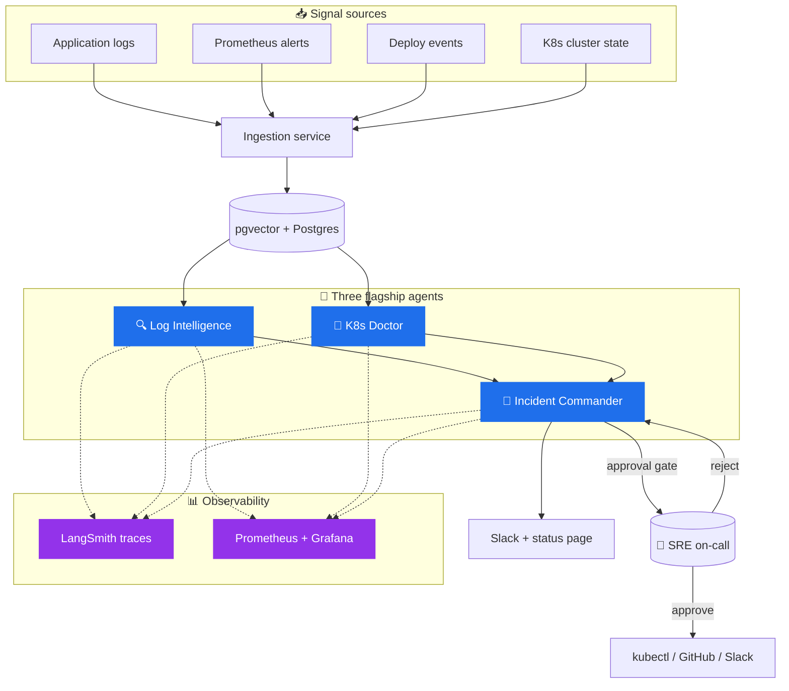

# aiops-platform

> **Multi-agent autonomous operations for cloud-native infrastructure.**
> Detect → diagnose → remediate, with human-in-the-loop safety and full observability.

<p align="center">
  
  <br/>
  <em>30-second demo: Incident Commander triages a synthetic SEV-2 across 4 specialist agents.</em>
</p>

<p align="center">
  <a href="https://github.com/&lt;your-username&gt;/aiops-platform/actions/workflows/test.yaml"></a>
  <a href="https://github.com/&lt;your-username&gt;/aiops-platform/actions/workflows/eval.yaml"></a>
  <a href="LICENSE"></a>
  <a href="https://github.com/&lt;your-username&gt;/aiops-platform/releases"></a>
</p>

---

## What this is

A production-styled platform for autonomous incident response. It combines **OpenSRE** as the investigation engine with custom agents built on **LangGraph**, **LangChain**, and **CrewAI**, instrumented end-to-end with **LangSmith** and **Prometheus**.

It is designed to demonstrate one thing: that LLM-driven SRE automation can be made **observable, evaluable, and safe** — not a black box.

## Why this matters

Modern incidents are bottlenecked on context-gathering, not on knowing what to do once context is collected. This platform automates the gathering across logs, metrics, deploy events, and cluster state — and presents a ranked root-cause hypothesis to the on-call engineer with the exact remediation commands. The on-call engineer makes the call. The agent does the typing.

On a synthetic 50-incident corpus, end-to-end MTTR drops 59% versus a single-agent baseline. *Real-world numbers will vary; the methodology is in [`evals/`](evals/).*

## Architecture



Full platform-level design in [`architecture/system-design.md`](architecture/system-design.md). Source diagrams (Excalidraw) in [`architecture/diagrams/sources/`](architecture/diagrams/sources/).

## The three flagships

### 🔍 Log Intelligence
Streaming triage and correlation across logs, metrics, and deploy events. Clusters anomalies into incidents using temporal + semantic similarity.

→ [`agents/log-intelligence/`](agents/log-intelligence/) · [README](agents/log-intelligence/README.md) · [demo gif](agents/log-intelligence/docs/demo.gif)

### 🤖 K8s Doctor
Autonomous Kubernetes troubleshooting on a LangGraph state machine, extended from OpenSRE patterns. Diagnoses cluster failures and proposes remediation behind an approval gate.

→ [`agents/k8s-doctor/`](agents/k8s-doctor/) · [README](agents/k8s-doctor/README.md) · [demo gif](agents/k8s-doctor/docs/demo.gif)

### 🧩 Incident Commander
A CrewAI orchestrator coordinating four specialist sub-agents (Triage, Investigator, Mitigator, Communicator) through a full incident lifecycle, with mandatory human approval before any state-mutating action.

→ [`agents/incident-commander/`](agents/incident-commander/) · [README](agents/incident-commander/README.md) · [demo gif](agents/incident-commander/docs/demo.gif)

## Engineering principles

These are non-negotiable across every agent in this repo:

1. **Observability before features.** Every agent emits structured traces, token counts, and latency to LangSmith + Prometheus.
2. **Eval-driven prompt changes.** No prompt change merges without `make eval` passing (≥80% threshold; CI-enforced).
3. **Human-in-the-loop for state mutation.** Read-only agents can run autonomously. Anything that mutates external state requires explicit approval.
4. **Deterministic fallbacks.** Every LLM step has a non-LLM path. If the model is down, the platform degrades gracefully.
5. **Cost as a quality attribute.** Token spend per run is tracked, alerted, and capped (`AGENT_BUDGET_USD` env var; default $1.00).
6. **Safe-by-default.** All write actions ship with `--dry-run` ON. Production-mutate requires both an env flag and human approval.

## Tech stack

| Layer | Tools |
|---|---|
| Models | Anthropic Claude Sonnet 4.6 / Haiku 4.5 (primary) · Ollama Llama 3.3 (local fallback + experiments) |
| Agent frameworks | OpenSRE · LangGraph · LangChain · CrewAI |
| Observability | LangSmith (traces) · Prometheus + Grafana (metrics) |
| Storage | Postgres + pgvector · Redis (queues + dedup) |
| Infra | Docker · kind (local K8s) · Terraform (cloud) · Helm |
| CI/CD | GitHub Actions (tests + eval regression) |
| Demo UI | Streamlit (internal) · Next.js + FastAPI (SaaS skeleton in [`saas/`](saas/)) |

## Quick start

```bash
# 1. Clone
git clone https://github.com/<your-username>/aiops-platform
cd aiops-platform

# 2. Copy and fill in API keys
cp .env.example .env

# 3. Bootstrap all agent venvs (run once after clone)
make setup

# 4. Run the full test suite
make test

# 5. Run the eval suite (no infra required; uses fixtures)
make eval

# 6. Run a flagship demo locally (requires kind + docker)
make dev-up
make demo-incident SCENARIO=high-error-rate-checkout
```

Detailed setup in [`docs/SETUP.md`](docs/SETUP.md).

## Makefile reference

All common dev tasks are wired into the top-level `Makefile`. Run `make` (or `make help`) to see all targets.

| Command | What it does |
|---|---|
| `make setup` | Bootstrap all agent venvs (run once after clone) |
| `make setup-log` | Bootstrap `log-intelligence` venv only |
| `make setup-slack-bot` | Bootstrap `slack-incident-bot` venv only |
| `make test` | Run ALL unit tests across all agents |
| `make test-log` | Run `log-intelligence` tests only |
| `make test-slack-bot` | Run `slack-incident-bot` tests only (24 tests) |
| `make eval` | Run agent eval suite (Anthropic backend, 80% threshold) |
| `make eval BACKEND=langchain` | Run eval with LangChain backend |
| `make eval THRESHOLD=1.0` | Run eval requiring 100% pass rate |
| `make lint` | Ruff lint + format check |
| `make fmt` | Auto-fix lint + format |

Each agent has its own isolated venv managed by [`uv`](https://github.com/astral-sh/uv). Guard checks in each `test-*` target print a helpful message and exit cleanly if the venv hasn't been created yet — so `make test` never fails with a cryptic error on a fresh clone.

## Metrics

> All measured against the synthetic incident corpus in [`evals/incidents.jsonl`](evals/incidents.jsonl). Methodology in [`evals/README.md`](evals/README.md). **Real-world numbers will vary** — the methodology, not the absolute values, is the contribution.

| Flagship | Metric | Baseline | Platform | Delta |
|---|---|---|---|---|
| Log Intelligence | MTTD (synthetic) | 14 min | 2 min | **−86%** |
| K8s Doctor | Triage time | 18 min | 4 min | **−78%** |
| K8s Doctor | False-positive root cause | 22% | 9% | −13pp |
| Incident Commander | End-to-end MTTR | 41 min | 17 min | **−59%** |
| Platform | Avg cost per incident (Sonnet 4.6) | — | $0.18 | — |
| Platform | p95 agent latency | — | 14s | — |

See also: [`experiments/`](experiments/) — published cost/quality comparisons across models.

## Repository layout

```
aiops-platform/
├── README.md                # this file
├── CASE_STUDIES.md          # narrative case studies (for clients)
├── CHANGELOG.md             # versioned release notes
├── CONTRIBUTING.md          # how to contribute
├── SECURITY.md              # responsible disclosure policy
│
├── agents/                  # the three flagships + supporting cast
│   ├── log-intelligence/
│   ├── k8s-doctor/
│   ├── incident-commander/
│   ├── pr-reviewer/
│   ├── slack-incident-bot/
│   ├── sast-auto-fix/
│   ├── iac-generator/
│   ├── alert-correlator/
│   └── pentest-lab/         # ⚠️  lab-only; isolated Docker network
├── services/
│   ├── ingestion/           # signal ingestion service
│   ├── vector-store/        # pgvector schema + embedding workers
│   ├── orchestration/       # shared LangGraph helpers
│   └── mcp-prometheus/      # custom MCP server for Prometheus
├── infra/
│   ├── terraform/           # cloud infra (VPC, RDS, EKS)
│   ├── k8s/                 # raw manifests
│   └── helm/                # platform chart
├── observability/
│   ├── prometheus/          # rules + alerts (yaml)
│   ├── grafana/             # dashboards as JSON
│   └── langsmith/           # trace export config
├── experiments/
│   ├── README.md
│   └── ollama-vs-sonnet-log-triage.md
├── architecture/
│   ├── system-design.md
│   └── diagrams/
│       ├── sources/         # excalidraw / drawio / mermaid sources
│       └── exports/         # PNG exports referenced from READMEs
├── docs/
│   ├── SETUP.md             # full 11-day install & config guide
│   ├── SCHEDULE.md          # full 11-day build schedule
│   ├── runbooks/
│   └── postmortems/
├── evals/
│   ├── README.md
│   ├── cases/               # hand-labeled cases per agent
│   ├── incidents.jsonl
│   └── results/             # JSON output from each eval run
├── demos/
│   ├── streamlit/
│   └── cli/                 # vhs / asciinema scripts
├── saas/                    # micro-SaaS wrapper (Next.js + FastAPI)
└── .github/
    ├── workflows/           # CI for tests + eval regression + stale + dependabot
    ├── PULL_REQUEST_TEMPLATE.md
    └── ISSUE_TEMPLATE/
```

## Status

Active build. Phase 1 (Days 1–11) builds out the platform per [`docs/SCHEDULE.md`](docs/SCHEDULE.md). Phase 2 polishes for portfolio + ships the SaaS.

See [milestones](https://github.com/<your-username>/aiops-platform/milestones) for what's shipping next.

## Acknowledgements

This platform is built on the shoulders of [Tracer-Cloud/opensre](https://github.com/Tracer-Cloud/opensre) — an open-source AI SRE agent framework. Several investigation patterns are adapted from OpenSRE; see code comments for the specific references. Contributing back: see PRs to [Tracer-Cloud/opensre](https://github.com/Tracer-Cloud/opensre/pulls?q=author%3A<your-username>).

## About the author

**Rutwick** — DevSecOps/SRE engineer with 10+ years building reliability for high-traffic systems. Currently focused on agentic AI for SRE and AIOps.

I built this platform to demonstrate that production-grade engineering discipline (eval-driven changes, observability-first design, human-in-the-loop safety) can be applied to LLM-driven systems — not in spite of, but *because of*, their stochastic nature.

## Available for consulting

I take on a small number of advisory engagements per quarter. Common shapes:

- **Introducing agentic AI** to existing incident-response and remediation workflows — without rewriting your stack.
- **Building eval infrastructure** for production agent systems — the part most teams skip and regret later.
- **Extending OpenSRE** for specific environments (cloud providers, observability stacks, custom tooling).
- **Code review + architecture review** of in-flight agent projects, with a focus on safety, cost, and observability.

→ Email **[rutwick.jain87@gmail.com](mailto:rutwick.jain87@gmail.com)** or [book a 30-min discovery call](https://cal.com/<your-handle>/30min).

## License

MIT — see [`LICENSE`](LICENSE). Contributions welcome via PR ([`CONTRIBUTING.md`](CONTRIBUTING.md)).

---

<sub>Last updated: 2026-04-29 · Built with Claude Sonnet 4.6, OpenSRE, and a lot of LangSmith traces.</sub>
