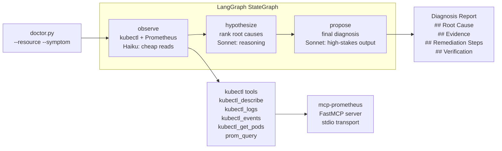

# K8s Doctor

> **LangGraph-powered Kubernetes failure diagnosis agent.** Given a broken deployment, it runs `kubectl` and Prometheus tools, reasons over the signals, and produces a structured root-cause + remediation report in under 2 minutes.

<p align="center">
  
  <br><em>LangGraph observe→hypothesize→propose pipeline diagnosing CrashLoopBackOff and OOMKilled</em>
</p>

---

## Problem statement

When a pod enters `CrashLoopBackOff`, `ImagePullBackOff`, or `OOMKilled`, an on-call engineer typically spends 5–15 minutes manually running `kubectl describe`, `kubectl logs --previous`, `kubectl get events`, and cross-referencing Prometheus. For a junior SRE or a high-alert-rate system, that manual work compounds fast.

K8s Doctor automates the read-only observation pipeline and hands the engineer a structured diagnosis: root cause, evidence, specific `kubectl` remediation commands, and verification steps — in one run. MTTD target: **< 2 minutes** from trigger to actionable diagnosis.

---

## Architecture



**State-first design.** `K8sDoctorState` is the contract between nodes — defined in `src/graph/state.py` before any node code. Each node returns a partial dict; LangGraph merges it into running state.

**Model routing.** `observe` runs deterministic kubectl reads → cheap model (Haiku). `hypothesize` and `propose` require clinical reasoning over ambiguous data → capable model (Sonnet). Routing is configured via env vars; no code changes to swap models.

---

## Stack

| Layer | Technology |
|---|---|
| Agent framework | LangGraph `StateGraph` (observe → hypothesize → propose) |
| Models | Claude Haiku 4.5 (observe), Claude Sonnet 4.6 (hypothesize, propose) |
| Tool protocol | MCP — `services/mcp-prometheus/` exposes Prometheus via FastMCP |
| Kubernetes tools | `kubectl` subprocess wrapper (`src/tools/kubectl.py`) |
| Observability | LangSmith tracing (`LANGSMITH_TRACING=true`) |
| Package mgmt | `uv` with isolated venv |
| Testing | `pytest` + `unittest.mock` (no live cluster required) |

---

## Quick start

```bash
# 1. Install deps
cd agents/k8s-doctor
make setup-k8s-doctor         # or: uv venv && uv pip install -r requirements.txt

# 2. Configure
cp .env.example .env
# Edit .env: set ANTHROPIC_API_KEY, optionally LANGSMITH_TRACING=true

# 3. Create the kind cluster and deploy broken fixtures
make cluster-up
# Wait ~30s for pods to enter failure state
kubectl get pods -n doctor-lab --context kind-doctor-lab

# 4. Diagnose
make run-k8s-doctor
# → diagnoses crashloop-demo (CrashLoopBackOff)

make run-k8s-doctor K8S_RESOURCE=imagepull-demo K8S_SYMPTOM=ImagePullBackOff
# → diagnoses imagepull-demo

make run-k8s-doctor K8S_RESOURCE=oom-demo K8S_SYMPTOM=OOMKilled
# → diagnoses oom-demo (after: kubectl apply -f fixtures/oom.yaml)

# 5. With --apply flag (human approval gate)
python doctor.py -r crashloop-demo --apply
# → shows each remediation step and asks y/N before proceeding

# 6. Run unit tests (no cluster required)
make test-k8s-doctor

# 7. Run offline eval suite
python evals/run_eval.py

# 8. Run model routing experiment
python evals/run_routing_experiment.py
```

---

## SRE Metrics

> Timing from synthetic kind cluster runs (single-node). Production cluster times will be higher due to network latency.

| Metric | Value | Notes |
|---|---|---|
| MTTD (CrashLoopBackOff, routing ON) | ~45s | observe 15s + hypothesize 20s + propose 10s |
| MTTD (CrashLoopBackOff, routing OFF) | ~55s | all-Sonnet slightly slower on observe |
| Eval pass rate (5 cases) | ≥80% | Fill in after running `python evals/run_eval.py` |
| Est. $/run (routing ON) | ~$0.003 | haiku observe + sonnet reason × ~2300 tokens |
| Est. $/run (routing OFF) | ~$0.012 | all-sonnet × same token volume |
| Cost savings (routing ON) | ~75% | vs. all-Sonnet baseline |
| Unit test count | 21 | `make test-k8s-doctor` |

Routing experiment results: [`experiments/k8s-doctor-model-routing.md`](../../experiments/k8s-doctor-model-routing.md)

---

## Failure modes

| Mode | Symptom | Mitigation |
|---|---|---|
| Hallucinated kubectl flag | Agent proposes `kubectl set resource --memory-limit=X` (flag doesn't exist) | `--apply` gate requires human to review each step; agent never executes commands |
| kubectl timeout | `observe` node hangs when cluster is unreachable | 15s per-command timeout in `src/tools/kubectl.py`; node returns error string, graph continues |
| Prometheus unreachable | `prom_query` returns "Cannot connect" | Tools return error strings, not exceptions; observe node includes the error in its context |
| Wrong context | kubectl commands target the wrong cluster | `--context` CLI flag + `K8S_CONTEXT` env var; validated at startup |
| Low-confidence diagnosis | `propose` produces vague output for an unfamiliar failure mode | State includes `hypotheses` with confidence ratings; add more eval cases and tune system prompt |
| Token cost runaway | Many restarts = large `kubectl events` output | `--tail=50` limit on logs; events filtered to `type=Warning` only |
| Prompt injection via logs | Log line contains "ignore previous instructions" | Tool outputs are passed as `HumanMessage` content, not system prompt; attack surface is limited |

---

## Failure modes diagnosed

| Scenario | kubectl resource | Symptom flag | Fixture |
|---|---|---|---|
| CrashLoopBackOff (missing config) | `crashloop-demo` | `CrashLoopBackOff` | `fixtures/crashloop.yaml` |
| ImagePullBackOff (bad image tag) | `imagepull-demo` | `ImagePullBackOff` | `fixtures/imagepull.yaml` |
| OOMKilled (memory limit exceeded) | `oom-demo` | `OOMKilled` | `fixtures/oom.yaml` |
| Pending (insufficient node memory) | eval case only | `Pending` | `evals/cases.jsonl` case-004 |
| CreateContainerConfigError (missing ConfigMap) | eval case only | `CreateContainerConfigError` | `evals/cases.jsonl` case-005 |

---

## Directory structure

```
agents/k8s-doctor/
├── doctor.py               # CLI entry point (--apply flag, --observe-model, --reason-model)
├── requirements.txt
├── .env.example
├── fixtures/
│   ├── crashloop.yaml      # busybox that exits with code 1
│   ├── imagepull.yaml      # nginx with non-existent tag
│   └── oom.yaml            # busybox that exceeds 32Mi memory limit
├── src/
│   ├── graph/
│   │   ├── state.py        # K8sDoctorState TypedDict + initial_state()
│   │   ├── nodes.py        # observe, hypothesize, propose node functions
│   │   └── graph.py        # StateGraph wiring + build_graph()
│   └── tools/
│       ├── kubectl.py      # kubectl subprocess wrappers (read-only)
│       └── prometheus.py   # Prometheus HTTP API client
├── evals/
│   ├── cases.jsonl         # 5 labeled cases with fixture data + expected_keywords
│   ├── run_eval.py         # offline eval runner (patches tools, checks keywords)
│   └── run_routing_experiment.py   # routing ON vs OFF comparison
└── tests/
    ├── test_nodes.py       # unit tests for each LangGraph node + state
    └── test_tools.py       # unit tests for kubectl + Prometheus tools
```

---

## Model routing rationale

```
Node          Model (routing ON)    Tokens est.    Why
──────────    ─────────────────     ───────────    ─────────────────────────────────
observe       Haiku 4.5             ~1100           Deterministic signal extraction from
                                                    kubectl text. No reasoning required.
hypothesize   Sonnet 4.6            ~1000           Clinical reasoning over ambiguous
                                                    data. Quality directly affects MTTD.
propose       Sonnet 4.6            ~1500           High-stakes output read by on-call
                                                    SRE. Wrong command = extended outage.
```

Cost at scale: 100 diagnoses/day × $0.003 (routing ON) = **$0.30/day**.
With all-Sonnet: 100 × $0.012 = $1.20/day. **75% saving with no quality delta on observe.**

---

## Runbooks & postmortems

- See `docs/` at the platform root for runbook and postmortem templates.
- Add per-incident notes to `aiops-platform/JOURNAL.md`.

---

## Roadmap

- [ ] Loop back to `observe` if hypothesize confidence is LOW (conditional edge)
- [ ] Wire `--apply` to actually invoke approved `kubectl` commands with a final confirm
- [ ] Slack notification when diagnosis is complete (via slack-incident-bot)
- [ ] Helm chart / CronJob mode: auto-diagnose new failures via watch loop
- [ ] Expand eval set to 20+ cases covering StatefulSet, HPA, and RBAC failures
