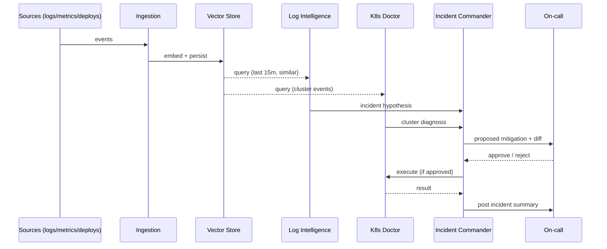

# Platform System Design

> Last updated: <date>. Owners: <you>. Status: design phase.

## Goals (and non-goals)

**Goals**
- Reduce simulated MTTR by ≥50% on a synthetic incident corpus (N=50)
- Operate with human-in-the-loop approval for any state mutation
- Provide full observability on agent decisions (LangSmith trace + Prom metrics)
- Run end-to-end on a single dev box (kind + Docker Compose) for portfolio demo

**Non-goals (in this iteration)**
- Multi-tenancy / SaaS billing (that's the separate Project 10 repo)
- Beating commercial AIOps vendors on coverage breadth
- Supporting clouds beyond AWS in v1

## Data flow

## Component responsibilities

### Ingestion
- Normalizes alerts (Prometheus, Datadog, CloudWatch) into a common envelope
- Embeds with Voyage AI; writes to pgvector with TTL of 30 days
- Backpressure: Redis Streams w/ consumer groups

### Vector Store
- pgvector + Postgres
- Schemas: `alerts`, `logs`, `deploys`, `runbooks`
- Indexed by (timestamp, embedding, service) — hybrid retrieval

### Log Intelligence Agent
- ReAct loop over read-only tools (`grep`, `cluster_errors`, `prom_query`)
- Output: structured triage Markdown w/ severity + confidence

### K8s Doctor Agent
- LangGraph state machine (symptom → observe → hypothesize → propose)
- Tools: `kubectl_describe`, `kubectl_logs`, `kubectl_events`, `prom_query`
- Mutating tools (`kubectl apply`) gated behind approval channel

### Incident Commander
- Orchestrator + 4 specialists (CrewAI)
- Holds shared state via Redis-backed checkpointer
- Approval gates emit Slack interactive messages

## Failure modes (platform-wide)

| Failure | Detection | Response |
|---|---|---|
| Anthropic API outage | `agent_error_rate > 5%` for 5m | Fall back to rule-based triage; halt mutations |
| pgvector unavailable | `vector_query_p99 > 5s` | Fall back to recency-only correlation |
| Approval channel offline (Slack down) | `pending_approvals > 0` for 10m | Auto-revert pending mutations; page on-call |
| Token cost spike | `$/incident > $1.00` | Switch to Haiku; alert |
| Prompt regression | `eval_pass_rate < 90%` post-deploy | Auto-rollback to previous prompt SHA |

## Observability plan

- **Traces:** LangSmith for every agent call. Project per flagship.
- **Metrics (Prometheus):**
  - `agent_request_duration_seconds{agent, step}`
  - `agent_tokens_total{agent, direction=in|out, model}`
  - `agent_tool_calls_total{agent, tool, status}`
  - `agent_eval_pass_rate{agent}` (set by CI on every prompt change)
- **Dashboards (Grafana, versioned in `observability/grafana/`):**
  - "Agent fleet overview" (latency, errors, $/h across all agents)
  - One per flagship (drill-down)
- **Logs:** structured JSON; correlation ID = incident ID

## Cost model (target)

| Component | Model | Avg tokens/run | Avg $/run |
|---|---|---|---|
| Log Intelligence | Sonnet 4.6 | ~6k in / 1k out | $0.03 |
| K8s Doctor | Sonnet 4.6 | ~12k in / 2k out | $0.06 |
| Incident Commander | Sonnet 4.6 (orch) + Haiku (sub) | ~25k mixed | $0.09 |
| **Total per incident** | | | **~$0.18** |

Hard ceiling per incident: $1.00. Auto-halt + page on breach.

## Security posture

- API keys: never in git; Kubernetes secrets w/ external-secrets-operator → AWS Secrets Manager
- Tool sandboxing: any code-execution tool runs in an ephemeral Docker container with no network egress
- Prompt injection defense: tool outputs sanitized; system prompt never includes user-controlled strings
- Audit log: every agent decision (input, plan, tools called, output) persisted for 90 days

## Open design questions

- Should the Incident Commander be allowed to spawn ad-hoc subagents, or is the 4-specialist set fixed? (Currently fixed for predictability.)
- How do we handle conflicting hypotheses between Log Intelligence and K8s Doctor? (Currently: present both to human; future: confidence-weighted merge.)
- Do we ship our own MCP servers or rely on community ones? (Currently: own for Prometheus + kubectl; community for everything else.)
